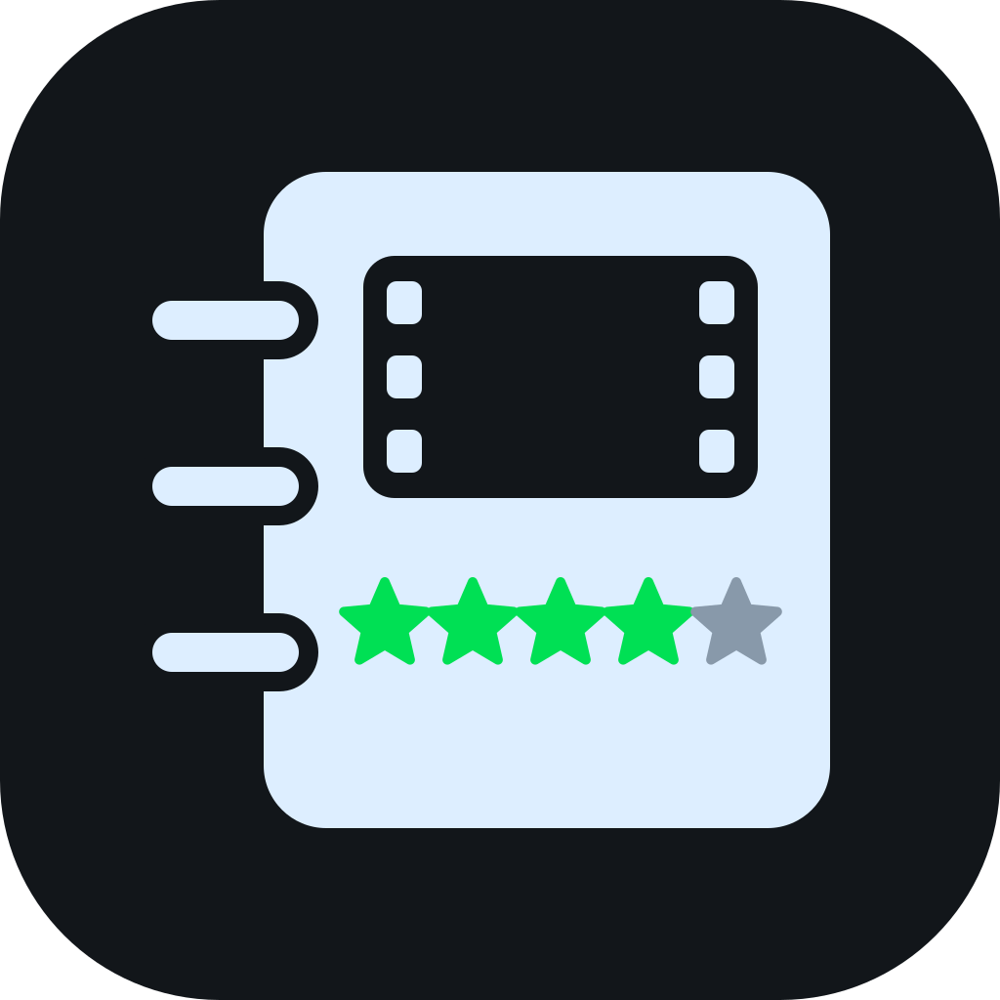
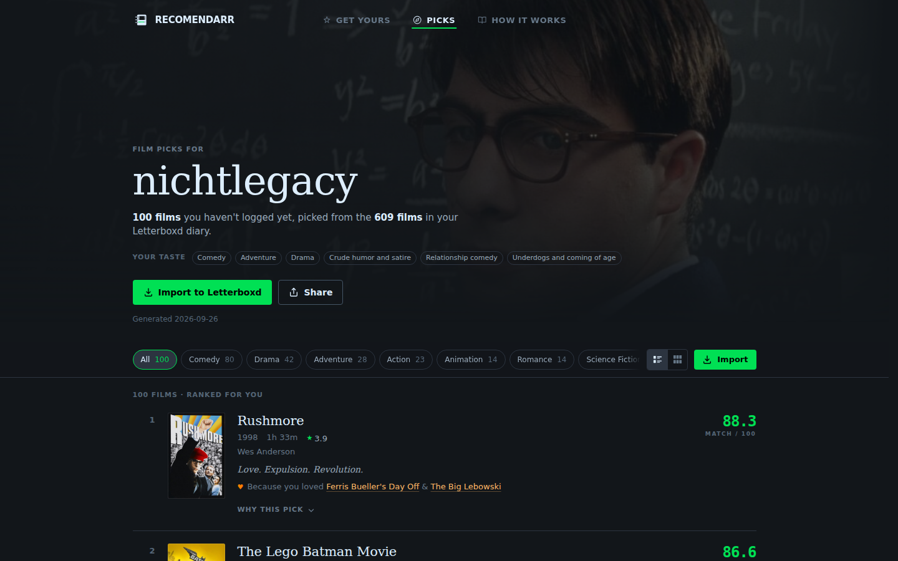
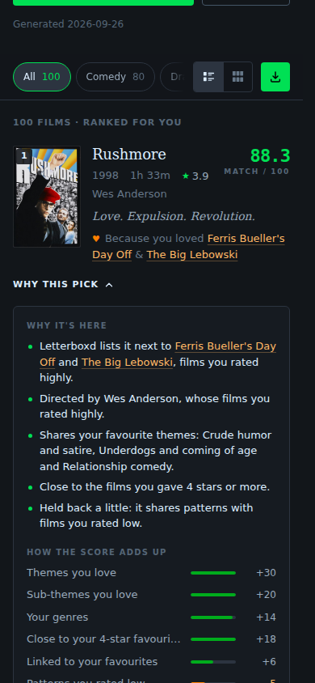
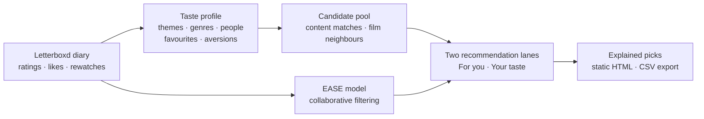

# Recomendarr

**A personal film recommendation project built around Letterboxd.**
 
From a film diary to ranked recommendations, with a reason behind every pick.

[Pics](#pics) • [How It Works](#how-it-works)

## Overview

I built Recomendarr to explore how a Letterboxd diary can become a useful,
explainable answer to “what should I watch next?” It combines a taste profile
from ratings, likes and film metadata with collaborative filtering, then
presents unseen films with the signals behind their scores.

This repository showcases the interface and documents the method. The
recommendation engine lives in a separate, private repository, and I run the
project for private use.

## Pics

The interface keeps two recommendation lanes separate:

- **For you** combines collaborative filtering with the Letterboxd average.
- **Your taste** uses themes, genres, directors, actors and favourite films,
  with a quality floor learned from the profile's ratings.

<table>
<tr>
<td width="50%" valign="top">

- **Ranked films** with posters, release year, runtime, director and rating.
- **Because you loved…** connects a pick to favourite films in the profile.
- **Why this pick** explains the score, matching themes and people.
- **Genre filters** and a **poster wall** provide different ways to explore.
- **CSV export** preserves the ranking and explanations as a Letterboxd list.
- **Responsive layout** adapts the same interface to desktop and phone.

</td>
<td width="50%" align="center">

</td>
</tr>
</table>

The [website](https://recomendarr.nichtlegacy.com) includes an example of the
rendered recommendations and the research behind them.

## How It Works

1. **Build a profile.** Weight the diary's themes, genres and people using
   ratings, likes and rewatches, including patterns associated with low ratings.
2. **Find candidates.** Combine films from those content signals with neighbours
   of favourite films and an EASE collaborative model trained on a sample of
   public Letterboxd profiles.
3. **Filter and rank.** Exclude already logged films, apply film and quality
   filters, and score each lane according to its purpose.
4. **Explain the result.** Render the recommendations with score components,
   matching metadata and links to the films behind each pick.

I evaluated the approach against rating, popularity and collaborative baselines,
using temporal holdouts to distinguish predicting future favourites from
separating liked and disliked films. Those comparisons led to the two-lane
design: collaborative filtering predicts future favourites better, while the
content engine also reaches rarer films.

The full method, evaluation and limitations are in
[How Recomendarr Recommends Films](https://recomendarr.nichtlegacy.com/paper/),
also available as [Markdown](site/paper/how-we-recommend-films.md) and a
[standalone HTML paper](site/paper/recomendarr-paper.html).

### Implementation

The public site is static HTML and CSS with small scripts for filtering, layout
switching and navigation. GitHub Pages serves the showcase and paper; a build
step checks local assets, links and CSV files before publication. Generated
recommendation pages are stored separately from this public repository.

The interface sets no cookies; self-hosted Umami counts visits anonymously.
The engine reads public Letterboxd data; the rendered pages show
recommendations and their explanations rather than reproducing a diary or
reviews.

## Disclaimer

Recomendarr is an unofficial, independent hobby project, unaffiliated with
Letterboxd Limited. Posters and film data belong to their respective owners
and are shown as Letterboxd serves them.

Built by <a href="https://github.com/nichtlegacy">nichtlegacy</a>

