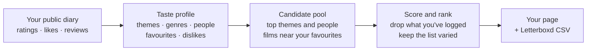
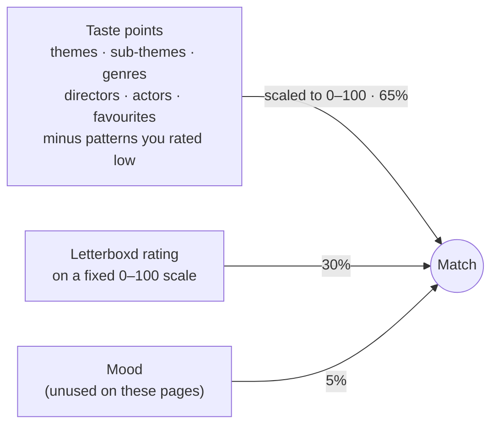

<div align="center">


# Recomendarr

**Film picks from your Letterboxd diary, ranked by what you already loved.**
<br>
Around a hundred films you haven't logged yet, each with the reason it's there,
on a page of your own and as a list you can import into Letterboxd.

[](.github/workflows/pages.yml)
[](#import-into-letterboxd)
[](#your-data)
[](#get-your-picks)

[Website](https://recomendarr.nichtlegacy.com) • [Paper](https://recomendarr.nichtlegacy.com/paper/) • [Get your picks](#get-your-picks) • [What's on a page](#whats-on-a-page) • [How it works](#how-it-works) • [Your data](#your-data) • [Repository](#repository)


</div>

## Overview

Recomendarr reads a public Letterboxd diary, works out the themes, genres,
people and films someone rates highest, and ranks the films they haven't logged
yet against that taste. This repository is the public side of it: the site and
the pages that people asked for.

The project stays deliberately:

- **on request**: a page exists only because someone asked for one. There is
  no directory of users.
- **link-only**: pages sit at unguessable addresses and tell search engines to
  stay away.
- **explainable**: every pick shows why it's there and how its score adds up.
- **static**: plain HTML and CSS with a few lines of script. No backend, no
  cookies, no analytics.

> An unofficial hobby project, not affiliated with Letterboxd. The engine that
> computes the picks lives in a separate, private repository.

## Get your picks

1. **Comment your Letterboxd username** in the Reddit thread, e.g. `nichtlegacy`.
   Add a release span like `1990-2010` if you only want films from those years.
   If you'd rather not ask in public, send a DM instead.
2. **Get a link back** to your page.
3. **Import the list** into Letterboxd, if you want it there too.

## What's on a page

<table>
<tr>
<td width="50%" valign="top">

- **Ranked picks** with poster, year, runtime, director and Letterboxd rating.
- **Because you loved…**: the films in your diary that Letterboxd places next
  to the pick.
- **Why this pick**: expand any film to see the reasons in plain words, the score
  broken into its parts, the themes and people that matched, and links to
  Letterboxd, IMDb and TMDB.
- **Genre filter** and a **poster wall** view.
- **Import to Letterboxd** from the header, or from a bar at the bottom on phones.

</td>
<td width="50%" align="center">


</td>
</tr>
</table>

### Import into Letterboxd

Each page comes with a CSV in
[Letterboxd's import format](https://letterboxd.com/about/importing-data/):
`tmdbID, imdbID, Title, Year, Directors`. The IDs match films exactly, and
Letterboxd keeps the order of the file, so the list comes out ranked the same
way as the page.

Download the CSV, create a list at
[letterboxd.com/list/new](https://letterboxd.com/list/new/), click **Import**
and pick the file. Importing works on letterboxd.com in a browser, not in the
Letterboxd apps.

## How it works



A pick's match score blends three signals:



The full method, with a temporal holdout evaluation, is in the paper:
[on the website](https://recomendarr.nichtlegacy.com/paper/), as
[Markdown](site/paper/how-we-recommend-films.md), or as a
[single HTML file](site/paper/recomendarr-paper.html) that opens offline.

## Your data

- **Only public data.** The engine reads your public diary and ratings, the
  same pages anyone can open on Letterboxd.
- **Picks, not your diary.** The page shows recommendations and the tastes they
  match. It doesn't show your diary, your ratings or your reviews.
- **Out of search engines.** Every personal page carries
  `noindex, nofollow, noarchive`. They stay reachable for link previews on
  Reddit and Discord.
- **Not in this repository.** Personal pages are stored privately, so this
  public repository holds no usernames and no picks.
- **Removed on request.** Ask on Reddit or
  [open an issue](https://github.com/nichtlegacy/recomendarr/issues/new) and
  the page is taken off the site.

## Repository

```text
site/                     landing, 404, favicon, robots, sitemap
site/paper/               the paper: page, raw Markdown and its assets
site/app.css              the one stylesheet, shared by every page including u/
scripts/build_site.sh     assembles _site/ and checks it
.github/workflows/        Pages deploy
picks/                    gitignored: personal pages, checked out from a private repo
```

Personal pages are not in this repository. They live in a private repository,
and the Pages workflow reads them with a read-only deploy key (the Actions
secret `PICKS_DEPLOY_KEY`) and publishes them together with the site. Each page
is reachable only by its own link; nothing here lists them.

```sh
scripts/build_site.sh              # build _site/ (includes picks/ when present)
scripts/build_site.sh --serve      # build, then serve on 0.0.0.0:8000
scripts/build_site.sh --serve 8766 # on another port
```

The build fails when a placeholder is left unfilled, a referenced file is
missing, or a page has lost its CSV.

## Disclaimer

**Recomendarr is an unofficial, independent hobby project.** It is not
affiliated with, endorsed by or connected to Letterboxd Limited. Posters and
film data belong to their respective owners and are shown as Letterboxd serves
them.

<p align="center"><sub>Built by <a href="https://github.com/nichtlegacy">nichtlegacy</a></sub></p>
