# How Recomendarr Recommends Films

**An explainable Letterboxd recommender, what stronger baselines revealed about it, and the two-lane design that followed**

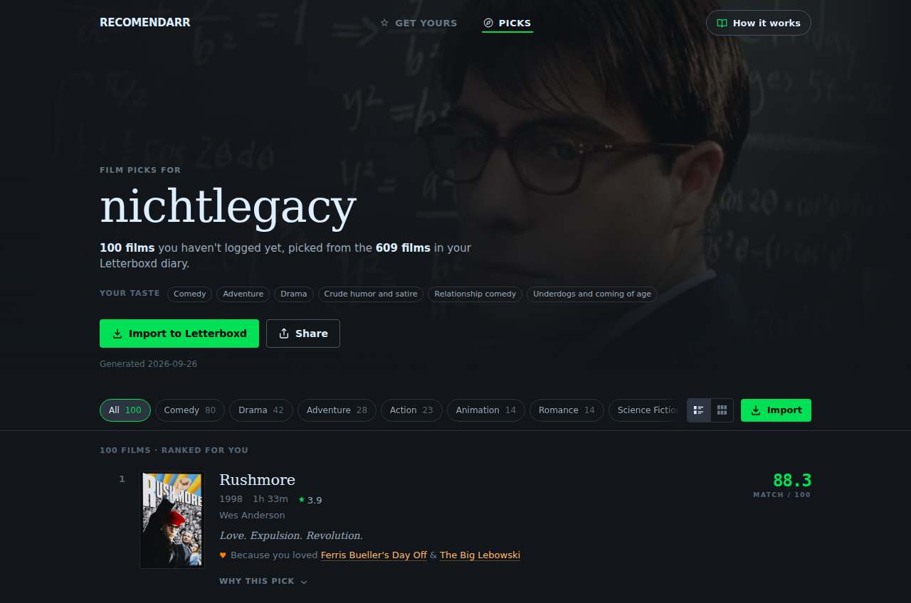

## Abstract

Recomendarr turns a Letterboxd diary into films the user has not seen and
explains every recommendation. Version 1 of this paper tested its content
engine against rating and random baselines and found it ahead, putting 6.2 %
of the films three users later enjoyed into its top 100. Those baselines were
too weak.

We added two stronger ones, both built from a sample of 500 public Letterboxd
profiles: the most-watched films of that sample, and EASE, a
collaborative-filtering model fitted on the films those users liked. Design
choices were made on 100 held-out test users. The headline numbers come from
83 **fresh** users sampled afterwards, whom neither the model nor any choice
ever saw.

**Collaborative filtering predicts what people go on to enjoy far better than
the engine:** 26.3 % of later favourites in the top 100, against 9.5 % for the
engine. Popularity alone already beats the engine (14.5 %).

A second test asks a different question: among films a user *did* watch, does
a score separate the ones they liked from the ones they did not? Here the
Letterboxd average is the strongest single signal (AUC 0.74). EASE comes
second (0.68). The engine is barely above a coin flip (0.59), because its
taste profile tracks what a user watches often rather than what they love.

**One gap only the engine fills: rare films.** About a third of later
favourites were logged by fewer than 10 % of the sample. EASE finds 1 of 805;
the engine finds 14.

The product now answers two questions separately:

- **"For you"** blends EASE with the Letterboxd average: 18.0 % Recall@100,
  nearly twice the engine.
- **"Your taste"** keeps the engine's profile and adds a personal quality
  floor learned from the user's own ratings. The floor more than halves bad
  picks (10.6 % → 4.4 %) and finds more later favourites than no floor or a
  fixed one.

Shown together, the two lanes contain 25.4 % of later favourites.

## Key findings

1. **Stronger baselines change the verdict.** Against rating and random order
   the engine looks good. Popularity in a user sample beats it by 5.0 pp
   [+2.8, +7.3], and collaborative filtering by 16.8 pp [+14.4, +19.2].
2. **Behaviour and taste are different tests.** Recall rewards predicting
   what someone watches next, which favours popular films. The taste test
   removes popularity by only comparing films the user watched, but it
   penalises genre matches, because users only venture outside their genres
   for well-reviewed films. We report both.
3. **The engine's profile measures habit, not love.** Its taste terms add
   almost nothing beyond a film's Letterboxd average: AUC 0.52 among films of
   similar rating, against 0.60 for EASE.
4. **Only the engine reaches rare films.** 805 of 2,572 later favourites are
   rare in the sample. EASE finds 1, the product's "For you" lane 3, the
   engine 14. This is the case for keeping the content engine.
5. **Two lanes, each measured on its own target.** "For you" is a deliberate
   trade: slightly below the pure Letterboxd average on taste (0.731 vs
   0.740), 3.7 times better at predicting what the user watches (18.0 % vs
   4.9 %), and personal rather than the same top-250 list for everyone.
   "Your taste" uses a per-user quality floor, ★3.0 for a tolerant profile
   and ★3.6 for a strict one, and beats a fixed ★3.4 floor by 1.3 pp recall
   [+0.5, +2.3].
6. **Refinements do help, given enough users.** With 3 profiles v1 could not
   show it. On the fresh users, removing the neighbour signal costs 1.7 pp
   [−3.0, −0.5], and so does the core model alone. Removing IDF *gains*
   1.2 pp [+0.5, +1.9].

## Contents

1. [The problem](#1-the-problem)
2. [System overview](#2-system-overview)
3. [The taste profile](#3-the-taste-profile)
4. [Candidate generation](#4-candidate-generation)
5. [Scoring and the two lanes](#5-scoring-and-the-two-lanes)
6. [Reranking and modes](#6-reranking-and-modes)
7. [Three case studies](#7-three-case-studies)
8. [Evaluation](#8-evaluation)
9. [Engineering](#9-engineering)
10. [Limitations and next steps](#10-limitations-and-next-steps)
- [Appendix A: formula sheet](#appendix-a-formula-sheet)
- [Appendix B: glossary](#appendix-b-glossary)

## 1. The problem

Movie metadata looks plentiful, and naive recommenders built on it tend to
fail in one of three ways:

- **Over-generalisation.** "Likes comedy" describes someone who loves
  slapstick and someone who loves deadpan equally well. Broad labels flatten
  taste.
- **Popularity drift.** When global rating dominates, the list turns into
  "good films" rather than "films for this person". Rating-ordered lists are
  the weakest predictors we measured (§8.2).
- **Opacity.** A bare "people like you liked this" says little about what
  the system understood about you.

Version 1 of Recomendarr answered with a content engine: pick a few hundred
candidates from the user's strongest signals, then rank them with terms a
person can read. That engine is still here. What changed is the evaluation
around it. Measured against a collaborative model and against popularity in a
user sample, it turned out to predict behaviour poorly and to add little taste
signal beyond film quality, while being the only component that reaches rare
films (§8). The product now keeps the engine for what it does well and adds a
collaborative lane for what it does not.

## 2. System overview

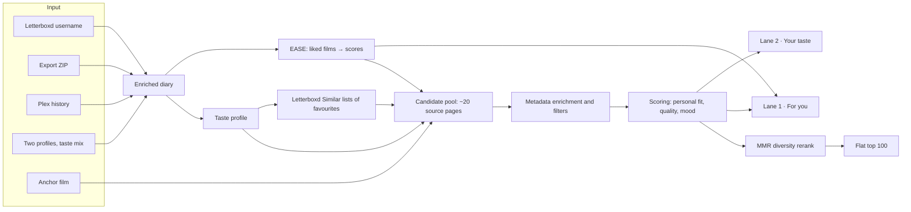

A live run now returns **two lanes** next to the engine's flat list:

| Lane | Question it answers | Score |
| --- | --- | --- |
| For you | What will you probably like? | 0.5 · EASE rank + 0.5 · Letterboxd-average rank |
| Your taste | More of what you like to watch | 0.5 · engine taste match + 0.25 · EASE + 0.25 · personal quality curve, above a personal floor |

The collaborative model (§4.4) is fitted offline once a month; a run only
sums stored weights, so it adds well under a second. The flat list stays in
the API for exports and saved runs; the interface shows the two lanes.

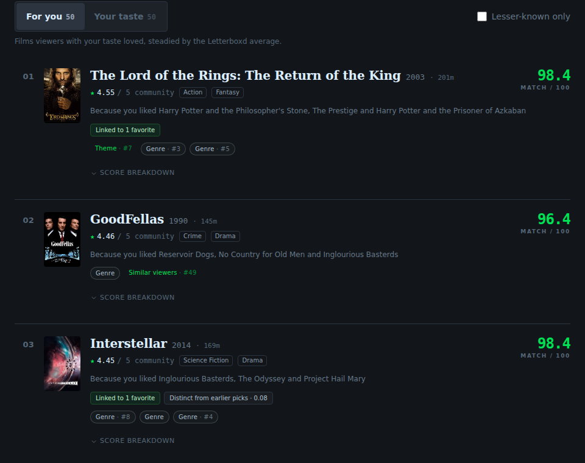

Every entry point runs the same core pipeline and differs only in where the
diary and the candidates come from:

| Entry point | Diary source | Candidate source |
| --- | --- | --- |
| Live username | the public diary and Films page | public Letterboxd pages |
| Letterboxd export ZIP | uploaded CSVs | local catalog cache |
| Plex history | Plex login + Tautulli, matched by title, year, TMDB/IMDb id | local catalog cache |
| Taste mix | two of the above, blended | live if any Letterboxd profile is involved |
| Similar to a film ("anchor") | optional username | anchor's own taxonomy + Similar list |

This paper describes the **live username flow with the app's default
settings**, including the default year window of 1985 to the current year.
The two lanes exist only in this flow; the other entry points return the
flat list.

## 3. The taste profile

The profile is the engine's picture of the user, and everything downstream
inherits its quality. It is built from diary entries enriched with
Letterboxd metadata (genres, themes, mini-themes, directors, actors).

### 3.1 Entry weight

Each diary entry gets a weight before it is added to its film's genres,
themes, mini-themes and people:

| Component | Effect |
| --- | --- |
| Base | 1.0 |
| Liked | +0.25 |
| Rewatch | +0.75 |
| Rating ≥ 4.5★ | + (rating − 3.5) |
| Rating 4.0★ | +0.5 |
| Rating 2.5★ | × 0.6 |
| Rating ≤ 2.0★ | × 0.3 |

A 5★ liked rewatch weighs 3.5, a plain 3★ watch 1.0 and a 1.5★ watch 0.3.

### 3.2 Per-film cap

Repeat watches add up, but **each film contributes at most 4.0 profile
weight**. If a film's entries sum to more, every entry is scaled by
`4.0 / total`. Favourite and aversion weights (below) are capped the same way
at 2.0 per film. Without this cap one comfort film could define the profile.

*The Big Lebowski* shows the effect. LEGACY logged it six times, mostly
4.5–5★ liked rewatches. Uncapped, those entries would add 17.75 to *Crude
humor and satire*, *Comedy* and Joel Coen, and 7.75 to the favourite cluster.
Capped, they add 4.0 and 2.0. Joel Coen dropped from the top director slot to
third as a result.

### 3.3 Favourite and aversion signals

Two further weights feed separate signal clusters:

```text
favourite: base 1.0 (≥4.5★), 0.5 (4.0★), 0.3 (3.5★), else 0
           +0.15 if liked; +0.35 on rewatch (≥4.0★) or +0.2 otherwise; max 1.4
aversion:  only for ratings ≤ 2.0★: 1.8 − 0.6 · rating
           +0.3 if explicitly not liked and ≤ 1.5★; × 0.5 on rewatch
```

The **favourite cluster** records which directors, themes, mini-themes and
actors recur in the films the user loved, as opposed to the films they merely
watched a lot. The films with the highest favourite weight become **seed
films** for the neighbour signal (§4.2). The **aversion cluster** records the
same for films rated 2★ or lower. Entries that are aversion-only do not feed
the positive director and actor lists at all.

A single low-rated entry shows the asymmetry. *Date Movie* (1.5★, not liked)
shares every comedy label with LEGACY's favourites, but it adds only
0.3 to the positive profile and 1.2 to the aversion cluster.

### 3.4 What the profile contains

The output holds weighted top lists (10 genres, 15 themes, 15 mini-themes,
15 directors, 20 actors, 10 countries), the favourite and aversion clusters
and the seed films. For LEGACY (609 enriched diary entries) the top of
the profile reads:

| Layer | Top entries (weighted score) |
| --- | --- |
| Themes | Crude humor and satire 412.9 · Relationship comedy 124.4 · Underdogs and coming of age 106.8 |
| Mini-themes | Gags, jokes, and slapstick humor 353.9 · Funny jokes and crude humor 326.6 · Amusing jokes and witty satire 260.5 |
| Genres | Comedy 455.6 · Adventure 159.6 · Drama 149.0 |
| Directors | Edgar Wright 10.8 · Makoto Shinkai 10.5 · Joel Coen 8.5 |
| Favourite themes | Crude humor and satire 84.5 · Relationship comedy 28.1 · Humanity and the world around us 27.3 |

### 3.5 What the profile measures

The base weight of 1.0 means every logged film counts, and a rating only
nudges it: a 3★ and a 3.5★ watch both count 1.0, a 4★ watch 1.5, and even a
5★ liked rewatch only 3.5. The profile therefore mirrors what a user
*watches often*. For LEGACY that is comedy, rated 3.2★ on average. §8.4
shows the consequence: the profile is a good guide to "more of the same" and a
poor guide to "what will you love". The second lane (§5.7) uses it for the
former.

## 4. Candidate generation

The ranker never sees the whole catalog. It sees a pool built from the
profile, which is the most consequential design decision in the system, as
§8.5 shows.

### 4.1 Source pages

The web app requests the **top 5 themes, top 3 mini-themes, top 5 genres,
top 3 directors and top 4 actors**, 20 Letterboxd pages in all, each browsed
by rating and capped at 72 films. A mood preset adds up to six more pages
(two genres, two themes, two mini-themes of the preset). Watched films are
skipped while collecting. Each film keeps a list of the pages that surfaced
it, which later feeds the multi-source bonus and the explanations.

### 4.2 Letterboxd neighbours

Letterboxd publishes a "Similar films" list per film. For the top 12 seed films
the engine reads up to 100 entries of that list and counts, for every
candidate, how many seeds list it. Films already in the pool get that count;
films not yet in the pool are added. It is Letterboxd's own item similarity
around films the user loved; the user-based collaborative model of §4.4 was
added later.

For LEGACY the neighbour step added 330 films to the pool and boosted
29 that were already there.

### 4.3 Enrichment and filters

Every candidate is enriched from a local metadata cache, or read from its
public Letterboxd page on a miss. The engine then drops:

- watched films (the full diary plus the Films page; a stale cached Films
  page is used if Letterboxd is unreachable, and with no copy at all the run
  fails instead of risking watched films in the output)
- TV entries (the TMDB link points to `/tv/`)
- anything under 20 minutes, outside the year window (app default
  1985–current year) or outside an optional runtime window

Trailers, bonus material and similar listings are not dropped but take a
−18 penalty (§5.1).

| Profile | Pages | Unique candidates (incl. neighbours) | of which neighbour-added | Ranked after filters |
| --- | ---: | ---: | ---: | ---: |
| LEGACY | 20 | 1,029 | 330 | 778 |
| NOIR | 20 | 808 | 296 | 571 |
| MIXTAPE | 20 | 1,325 | 545 | 1,029 |

### 4.4 Collaborative candidates (EASE)

The engine's candidates all come from the user's own labels. The second
source asks other people instead: which films did viewers who liked the same
films also like? We use **EASE** (Embarrassingly Shallow Autoencoders,
Steck 2019), a linear item-item model with a closed-form solution and a
single hyperparameter. It is among the strongest published baselines for
top-N recommendation from implicit feedback, and simple enough to fit on a
laptop.

- **Data.** 500 public Letterboxd profiles, sampled from film member pages
  (§8.1). For each, the Films page gives every logged film with its rating
  and like. A film counts as *liked* at ≥ 3.5★, or when liked without a
  rating. Films liked by fewer than five sampled users are dropped, which
  leaves about 7,600 films.
- **Model.** With `X` the users × films matrix of likes, EASE solves for an
  item-item weight matrix with a zero diagonal:

  ```text
  P = (XᵀX + λI)⁻¹            B = I − P · diag(1 / diag(P))            λ = 1000
  score(user, film) = Σ over the user's liked films j of B[j, film]
  ```

  With far fewer users than films, `P` comes from the Woodbury identity,
  which inverts a users × users matrix instead. The result is the same to
  within 10⁻⁸, and the fit needs 0.4 GB instead of 2.2 GB.
- **Liked, not watched.** Fitting on every logged film is the more common
  choice. On held-out users it is worse on both of our tests: Recall@100
  19.4 % vs 24.8 % on the test users the choice was made on, and 19.3 % vs
  26.3 % with taste AUC 0.61 vs 0.68 on the fresh ones.
- **Storage.** Each film keeps its 300 largest weights by magnitude,
  including negative ones. Keeping only positive weights cost a point of
  recall; the top 300 by magnitude match the full matrix within 0.2 pp.
  A run sums stored weights in plain Python.

In a run, EASE's 300 best-scoring unseen films join the pool before
enrichment, so they pass the same filters as every other candidate. The
engine's flat list ignores them; the lanes use them.

## 5. Scoring and the two lanes

Each surviving film gets three scores on a 0–100 scale: **personal fit**,
**quality** and **mood**. A blend of the three gives the engine's final
score (§5.1–5.5). The two lanes (§5.7) rank the same films differently.

### 5.1 Personal fit

Personal fit is a sum of capped, additive terms. A term matches either by
name on the film or by the slug of the source page that surfaced it. `r` is
the 0-based rank of the matched item in the user's top list, and `idf` is the
pool-local rarity weight from §5.2.

| Term | Points | Cap |
| --- | --- | ---: |
| Theme match | Σ max(0, 10 − 2r) · idf, over matched themes | 30 |
| Mini-theme match | Σ max(0, 6 − r) · idf | 20 |
| Genre match | Σ max(0, 5 − r) · idf | 15 |
| Director match | P · max(0, 1 − r/10) for the first of the film's directors found in the user's list. P = 10 with a theme/mini-theme match, 7 with only a genre match, 5 otherwise | 10 |
| Actor match | Σ P · max(0, 1 − r/15). P = 2 / 1.5 / 1, same context rule | 10 |
| Multi-source bonus | 6 · (S − 1) when S > 1. S sums source-type weights over the film's unique pages: theme 1.0, mini-theme 0.85, genre 0.65, director 0.35, actor 0.25, other (incl. neighbour) 0.4 | 12 |
| Favourite cluster | 5 · min(c, 3) for a shared favourite director; 1.5 · min(c, 4) per theme (≤ 6); 1.0 · min(c, 4) per mini-theme (≤ 4); 1.0 · min(c, 3) per actor (≤ 3). c = summed favourite weight | 18 |
| Neighbour match | 2.5 / 6 / 12 when 1 / 2 / ≥ 3 seed films list the candidate | 12 |
| Aversion penalty | director with aversion ≥ 2.0 → 6 (≥ 1.5 → 1.5); +1.0 per theme ≥ 3.0 (≤ 3); +0.5 per mini-theme ≥ 3.0 (≤ 1.5); +0.5 per genre ≥ 4.5 (≤ 1); at most 11.5 in practice | −15 |
| Promo penalty | −18 for trailers, bonus material and similar listings | — |

People terms deliberately depend on context. A shared director is worth
twice as much when the film already matches the user's themes, so a
favourite actor alone cannot carry an off-taste film.

The total is normalised with a fixed divisor:

```text
personal = min(100, personal_total / 80 · 100)
```

The theoretical maximum is about 127, so a film saturates at 100 once it
collects 80 points. That keeps ordinary matches well below 100, but it also
means several top films tie at 100 (§10).

### 5.2 Pool-local IDF

Theme, mini-theme and genre points are multiplied by a rarity weight
computed over the filtered pool of the current run:

```text
idf(term) = min(3.0, ln((N + 1) / (df + 1)) + 1)      (N = pool size, df = films with the term)
```

The weight runs from 1.0 for a label every candidate shares up to 3.0 for
rare ones, so IDF only ever boosts rare overlaps. In a comedy-heavy pool
*Comedy* stays near 1.0 while a rare mini-theme can approach 3.0. The caps
still apply after the multiplication.

### 5.3 Quality

```text
quality = clamp(letterboxd_rating · 20, 0, 100)      (0 if unrated)
```

This is the only place the global rating enters the score. It is used on
its fixed five-star scale rather than as a percentile within the pool,
which would exaggerate tiny rating differences.

### 5.4 Mood

Mood presets (14 moods, 17 vibes and a neutral "all") map to real genres, themes and mini-themes:

```text
mood = clamp(8·genre_hits (≤24) + 14·theme_hits (≤42) + 10·mini_hits (≤30) − 12·avoid_hits (≤36), 0, 100)
```

Hard gates stop broad matches. Eight presets (angry, tense, teen comedy,
revenge, noir, fighting, heist, adrenaline) score 0 unless one of their
defining mini-themes matches. *Romcom* needs both Comedy and Romance. Stoner,
superheroes, horny and heist additionally check the title and description for
keywords. With the neutral preset, mood is 0.

### 5.5 Blend

| Mode (UI label) | Final score |
| --- | --- |
| Personal (default) | 0.65 · personal + 0.30 · quality + 0.05 · mood |
| Taste & mood | 0.35 · personal + 0.40 · mood + 0.25 · quality |
| Mood first | 0.65 · mood + 0.30 · quality + 0.05 · personal |

Films below a final score of 15 are dropped. Picking a mood switches the app
to *Taste & mood* and drops films whose mood score is below 30.

### 5.6 Explanations

Each recommendation ships its full breakdown and the preferences it matched,
and the interface turns both into plain language: why the film is there,
how the score adds up, and which of the user's tastes it touches.

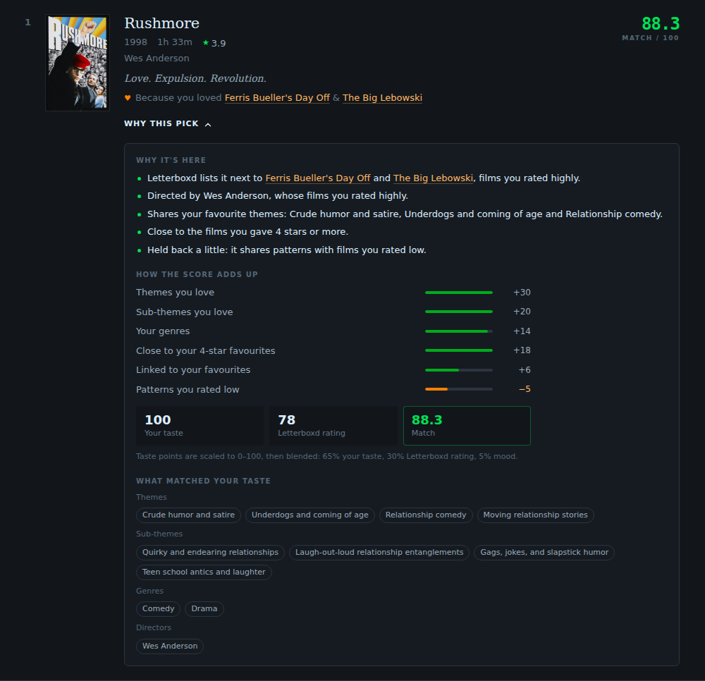

### 5.7 The two lanes

Both lanes rank the same enriched, filtered pool. Scores are rank
percentiles within the pool, so the parts are on a common 0–1 scale.

**Lane 1, "For you"**, covers films EASE can score:

```text
for_you = 0.5 · pct(EASE score) + 0.5 · pct(Letterboxd average)
```

EASE alone predicts behaviour best but pulls towards popular films; the
Letterboxd average is the best single predictor of whether a watched film is
liked (§8.3). The weight 0.5 is the smallest quality share at which the taste
AUC comes within about 0.01 of the average alone, while recall stays far
above it. On the 100 test users used for design choices that is 0.5. On the
83 fresh users the gap at 0.5 is 0.009, so the rule gives 0.5 again (on one
half of the first 100 it would have given 0.65: the balance point moves a
little with the sample). Each pick is explained by the three liked films that
contribute most to its EASE score ("Because you liked …").

**Lane 2, "Your taste"**, covers only films the engine's own sources found,
and leaves out films already in lane 1:

```text
your_taste = 0.5 · pct(engine taste terms) + 0.25 · pct(EASE) + 0.25 · pct(like(q))
```

The taste terms are the engine's §5.1 terms before normalisation; EASE only
breaks ties between equally good matches. `like(q)` is the user's
**personal quality curve**: for each Letterboxd-average bin (below 3.0, then
0.2 steps up to 4.0 and above), the share of the user's own first watches
they rated ≥ 3★, smoothed towards their overall rate with ten pseudo-films.
The **personal floor** is the lowest bin edge from which every higher bin
stays under 30 % bad picks (≤ 2.5★). It is ★3.0 for LEGACY, ★3.2 for
MIXTAPE and ★3.6 for NOIR, three profiles with very different tolerance for
weaker films (§8.6). Films below the floor are dropped from the lane.

Both lanes then go through the diversity rerank of §6.1 and keep 50 films.
Leaving lane-1 films out of lane 2 lowers lane 2's own recall, but both lanes
together find more later favourites than two overlapping lists (§8.6). In a
mood mode both lanes keep only films with a positive mood match. Re-cuts of
watched films (an edition marker such as "extended" or "The Whole Bloody
Affair" plus the same base title and director) are dropped. If the model is
missing or the user has fewer than ten liked films it knows, lane 1 is empty
and says why; lane 2 then gives the EASE quarter to the taste match.

## 6. Reranking and modes

### 6.1 Diversity (MMR)

The engine scores the top 800 films (limit 100 × pool multiplier 8) and
reorders them with maximal marginal relevance:

```text
pick next = argmax  λ · score/score_max − (1 − λ) · max similarity to already picked     (λ = 0.75)
similarity = weighted Jaccard: directors 0.40, mini-themes 0.25, themes 0.20, genres 0.15
```

On top of that, if one genre covers at least 70 % of the pre-rerank top 100,
**every fifth slot** is reserved for the best film without that genre, as
long as it scores within 30 points of the leader. For LEGACY this is
why *The Lord of the Rings: The Return of the King* (74.8) sits at rank 5 and
*Interstellar* (69.5) at rank 10 between comedies scoring 83–88. Scores are
never changed by the rerank, only positions. Director concentration
(Herfindahl index) falls from 0.0156 to 0.0116 for LEGACY and from
0.0222 to 0.0122 for MIXTAPE.

### 6.2 Similar to a film

Given an anchor film, the pool also pulls the anchor's themes, mini-themes
and top two directors, and the anchor becomes seed number one (user seeds are
cut to 6). An anchor score rewards films on the anchor's Similar list
(neighbour tier × 2) and shared taxonomy
(4 per theme + 2.5 per mini-theme + 5 per director, capped at 16 and halved
off the Similar list), normalised by 30. With the default *balanced*
strength, final = 0.4 · blend + 0.6 · anchor. Without a username the profile
is empty, so the list is driven by the anchor alone.

### 6.3 Taste mix

Two profiles (Letterboxd and/or Plex) are merged by normalised rank, so a
long diary cannot drown out a short one, and items both people share rank
first. Favourite signals keep only what both share (minimum weight); aversion
keeps what either dislikes (maximum weight). Neighbour seeds interleave
shared favourites first, then each person's.

## 7. Three case studies

We use three public Letterboxd profiles with different tastes, shown under
pseudonyms: LEGACY is the author's own profile, NOIR and MIXTAPE belong to
two volunteers. All runs use the app's default settings and the 1985–2026
window.

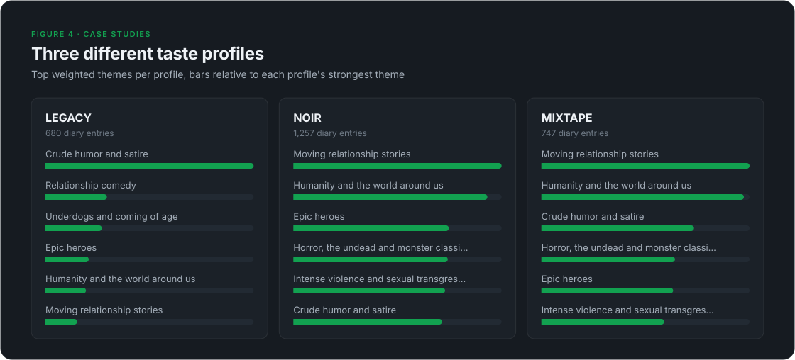

| | LEGACY | NOIR | MIXTAPE |
| --- | --- | --- | --- |
| Enriched diary entries | 609 | 1,256 | 746 |
| Watched films excluded | 633 | 3,695 | 770 |
| Leading theme | Crude humor and satire | Moving relationship stories | Moving relationship stories |
| Leading mini-theme | Gags, jokes, and slapstick humor | Twisted dark psychological thriller | Twisted dark psychological thriller |
| Top directors | Edgar Wright, Makoto Shinkai, Joel Coen | Yorgos Lanthimos, Wes Anderson, Ari Aster | Yorgos Lanthimos, Wes Anderson, Luca Guadagnino |
| Diary entries rated ≤ 2★ (aversion entries) | 39 | 357 | 188 |

### 7.1 Top recommendations

| Rank | LEGACY | NOIR | MIXTAPE |
| ---: | --- | --- | --- |
| 1 | Rushmore (1998) · 88.3 | Cure (1997) · 90.7 | Parasite (2019) · 92.2 |
| 2 | The Lego Batman Movie (2017) · 86.6 | Monster (2023) · 89.3 | Evil Dead II (1987) · 87.6 |
| 3 | The Ballad of Buster Scruggs (2018) · 86.9 | Sympathy for Mr. Vengeance (2002) · 83.9 | The Silence of the Lambs (1991) · 91.0 |
| 4 | After Hours (1985) · 86.1 | The Strange Thing About the Johnsons (2011) · 83.8 | The Royal Tenenbaums (2001) · 89.7 |
| 5 | The Lord of the Rings: The Return of the King (2003) · 74.8 | Chainsaw Man – The Movie: Reze Arc (2025) · 78.3 | Avengers: Endgame (2019) · 86.7 |

Rank order and score order differ because of the rerank (§6.1). The lists
follow each profile: slapstick and comic chaos for LEGACY, dark
psychological cinema for NOIR, a mix of horror, prestige drama and
blockbusters for MIXTAPE.

### 7.2 What the top 10 is made of

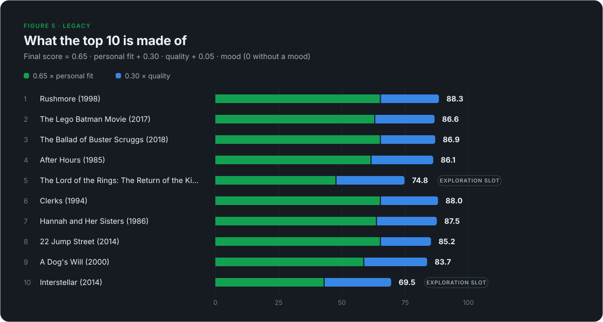

Averaged over LEGACY's top 10, the terms are: theme 24.3, mini-theme
16.0, genre 13.6, favourite cluster 15.2, multi-source 4.5, neighbour 3.5,
director 1.1, actor 0.9 and aversion −2.9. Personal fit averages 91.7 and
quality 80.1. The list is won by themes and the favourite cluster, not by
familiar names.

### 7.3 One recommendation, end to end: *Rushmore*

1. **Retrieval.** *Rushmore* is on none of the 20 source pages. It entered
   the pool because Letterboxd lists it as similar to two of LEGACY's
   seed films, *Ferris Bueller's Day Off* and *The Big Lebowski*.
2. **Personal fit.** It carries the user's top three themes (theme term at its
   cap of 30), enough top mini-themes to reach that cap too (20), and Comedy
   and Drama (genre 14.0 after IDF). It shares enough favourite signals to hit the
   cluster cap of 18. Two seeds give neighbour 6.0. The aversion penalty costs
   −5.0: the maximum 3.0 for themes plus mini-themes and genres the user also
   often rates low. LEGACY's strongest aversion theme is also their
   strongest positive one, because the thresholds are absolute; relative
   aversion is open work (§10).

   ```text
   personal_total = 30 + 20 + 14.0 + 18 + 6 − 5 = 83.0
   personal       = min(100, 83.0 / 80 · 100) = 100
   ```

   The multi-source bonus is 0: its only source is the neighbour row
   (weight 0.4 < 1). The theme, mini-theme and genre values include this
   run's pool-local IDF weights; the steps below start from those terms.
3. **Quality.** Letterboxd rating 3.89 → 3.89 · 20 = 77.8.
4. **Blend.** `0.65 · 100 + 0.30 · 77.8 + 0.05 · 0 = 65.0 + 23.3 = 88.3`.
5. **Explanation.** "Shares signals with your top-rated films · Letterboxd
   lists this near several of your favorites · Matches your top themes: Crude
   humor and satire, Underdogs and coming of age".

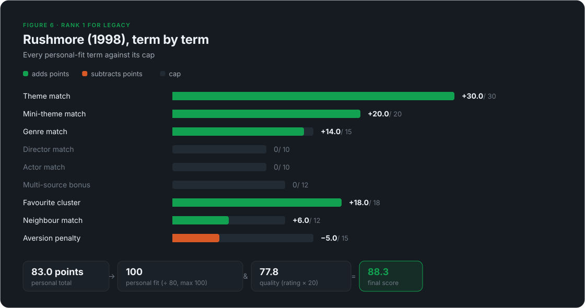

### 7.4 The two lanes for LEGACY

The same profile, run through the lanes (EASE fitted without the held-out
test users):

| # | For you | Because you liked … | Your taste | Matches |
| ---: | --- | --- | --- | --- |
| 1 | The Lord of the Rings: The Return of the King (★4.55) | Harry Potter and the Philosopher's Stone, The Prestige | When Harry Met Sally… (★4.07) | Relationship comedy |
| 2 | The Godfather (★4.52) | 12 Angry Men, Pulp Fiction | The Lego Batman Movie (★3.97) | Crude humor and satire, Epic heroes |
| 3 | Schindler's List (★4.54) | The Shawshank Redemption, Good Will Hunting | No Other Choice (★4.09) | Humanity and the world around us |
| 4 | Interstellar (★4.45) | Inglourious Basterds, Project Hail Mary | A Serious Man (★3.86) | Crude humor and satire, Faith and religion |
| 5 | Se7en (★4.37) | Good Will Hunting, Pulp Fiction | The Fabelmans (★4.00) | Moving relationship stories |
| 6 | Spirited Away (★4.44) | Everything Everywhere All at Once, Your Name. | The Blues Brothers (★4.01) | Crude humor and satire, Song and dance |
| 7 | Django Unchained (★4.33) | Inglourious Basterds, Kill Bill: Vol. 1 | Hunt for the Wilderpeople (★4.08) | Moving relationship stories |
| 8 | There Will Be Blood (★4.46) | No Country for Old Men, The Big Lebowski | 22 Jump Street (★3.37) | Underdogs and coming of age |

The lanes answer their two questions visibly. "For you" is the canon a
viewer with LEGACY's favourites has not yet seen: the model's evidence is
that such viewers love these films, and LEGACY's own ratings of the 4★+
bin (0 bad picks in the diary) agree. "Your taste" is the comedy-heavy
profile of §3.4, now above the personal floor of ★3.0. *22 Jump Street*
(★3.37) stays in: at that average LEGACY still enjoys 82 % of films, so a
fixed ★3.4 floor would have been too strict for this user. *Rushmore* is at
rank 9.

## 8. Evaluation

### 8.1 Method

Two questions, two tests:

- **Behaviour (temporal holdout, Recall@K).** Given what a user had watched
  up to a date, would the system have suggested the films they went on to
  enjoy? Each dated diary is cut into consecutive test windows of 10 % of
  the diary; each fold trains on everything before its window. **Positives**
  are first watches in the window (no rewatch, not in the training diary)
  rated ≥ 3.5★, or liked if unrated. Lane 2, which serves "films I enjoy
  watching", is also scored with ≥ 3★ positives. We report the share of
  positives in the top 100 (Recall@100).
- **Taste (AUC among watched films).** Take every rated first watch in the
  window. Each score ranks these films using only the training history. AUC
  is the probability that a film the user liked (≥ 3.5★) outranks one they
  did not: 0.5 is a coin flip. Because every film was watched, popularity and
  exposure drop out.

**The collaborative sample.** 500 public profiles were drawn from Letterboxd
film member pages: 233 via random popular films and 267 via films from the
case profiles' diaries (12 further profiles had under 50 films and were
skipped). The median profile logs 852 films; about a tenth reach the scrape
cap of 3,024. After the test users are removed, the model trains on 395 of
them; 6 users drawn via a film a case profile logged inside a test window are
dropped too, so seeding cannot leak test positives.

**Three groups of profiles:**

| Group | Users | Folds each | Role |
| --- | ---: | ---: | --- |
| Case profiles (LEGACY, NOIR, MIXTAPE) | 3 | 5 | continuity with v1: the engine again finds 27 of 437 |
| First test users | 100 | 2 | held out of the model; **all design choices were made on them** |
| **Fresh test users** | **83** | **2** | **sampled after every choice was fixed; the headline numbers** |

Both test groups are sampled users with an active, rated diary. For the
first group 200 profiles were checked (100 kept; 39 had no diary, 35 a
sparse one, 26 a mostly unrated one). For the fresh group, 300 new profiles
were sampled the same way (half via random popular films, half via films the
case profiles liked early in their diaries); 163 were checked and 83 kept
(34 / 23 / 23). The other new profiles were discarded again, so the model the
fresh users are scored against is identical to the one used for the choices.
Median test diary: 391 dated entries (first), 286 (fresh).

Intervals are 95 % bootstrap intervals from resampling **users** (5,000
rounds), which treats a user's folds as dependent. All runs use the app's
default configuration and are tied to a commit (`evaluation-v2.json`).

### 8.2 Baselines matter

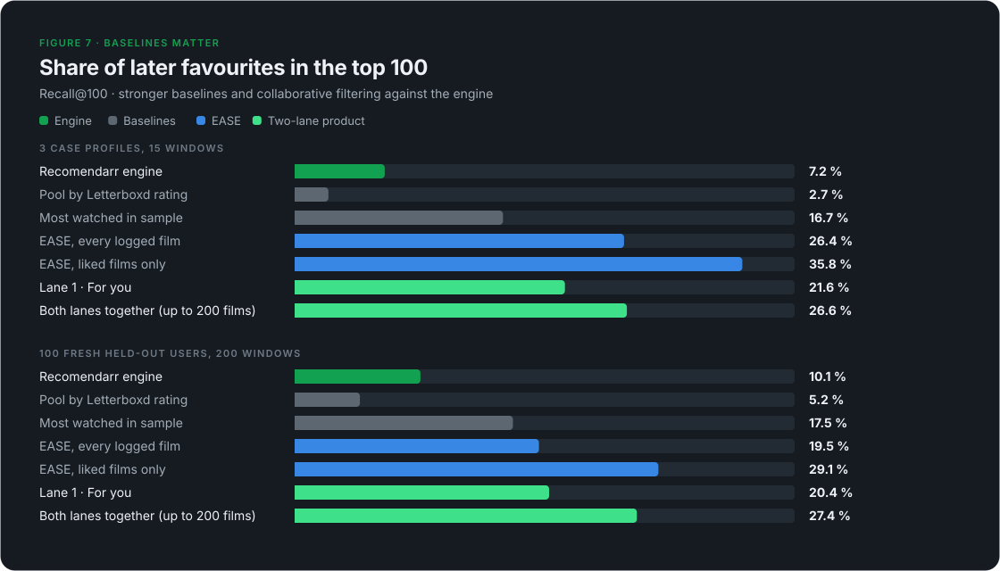

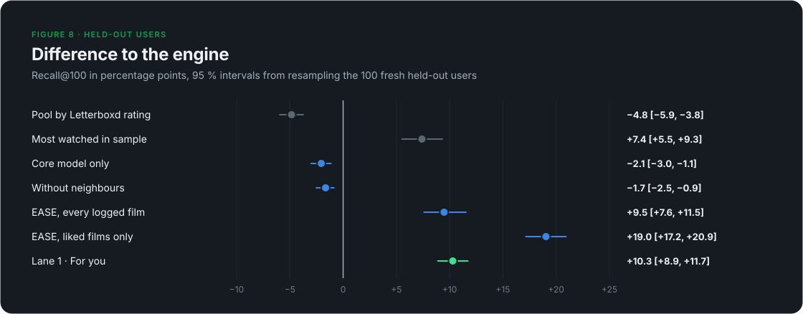

On the 83 fresh users (2,572 positives):

| Method | Recall@100 | vs engine [95 %] |
| --- | ---: | --- |
| Engine | 9.5 % | |
| Same pool, random order | 3.5 % | −6.1 [−7.6, −4.7] |
| Same pool, by Letterboxd rating | 4.9 % | −4.7 [−6.1, −3.4] |
| Top-rated catalog | 1.4 % | −8.1 [−9.8, −6.7] |
| **Most watched in the sample** | **14.5 %** | **+5.0 [+2.8, +7.3]** |
| EASE, every logged film | 19.3 % | +9.8 [+7.3, +12.4] |
| **EASE, liked films** | **26.3 %** | **+16.8 [+14.4, +19.2]** |

The v1 baselines still trail the engine. The two stronger ones do not.
*Most watched* is the same 100 popular films for everyone, minus what the
user has seen, and it already beats the engine. The first 100 test users and
the case profiles show the same order (engine 10.2 % and 6.2 %, most watched
12.2 % and 14.0 %, EASE 24.8 % and 33.2 %). A rating-sorted list looks
personal and is not: rating is a property of the film, while what someone
watches next depends on who they are and on what is popular.

### 8.3 Behaviour versus taste

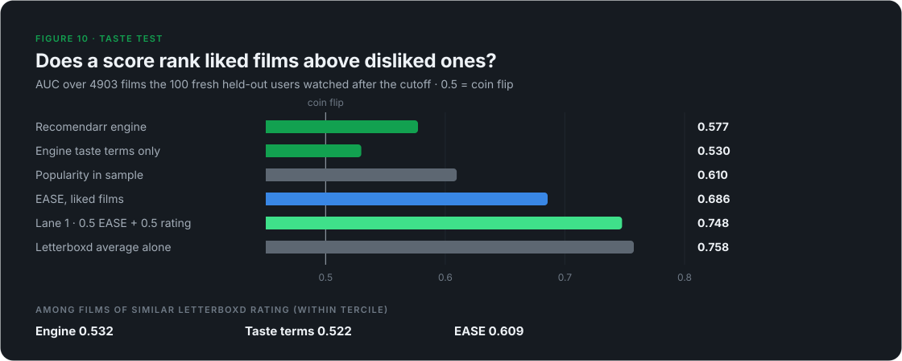

On the 3,424 rated first watches of the fresh users (2,105 liked):

| Score | Taste AUC |
| --- | ---: |
| Engine | 0.586 |
| Engine taste terms only | 0.536 |
| EASE, every logged film | 0.606 |
| Popularity in the sample | 0.609 |
| EASE, liked films | 0.679 |
| Lane 1, 0.5 EASE + 0.5 Letterboxd average | 0.731 |
| **Letterboxd average alone** | **0.740** |

The ranking of methods flips between the tests. Popularity and EASE
dominate recall; the plain Letterboxd average dominates taste. Both tests
are biased, in opposite directions:

- **Recall** rewards predicting behaviour. Popular films are watched by
  nearly everyone eventually, so a method that ranks them high collects
  hits whether or not it understood the user.
- **The taste test** only sees films the user chose to watch, and that choice
  is not random. Inside their usual genres people watch casually and rate
  middling; outside them they mostly watch what was recommended to them or
  well reviewed, and rate it well. Matching the user's genres is therefore
  penalised by construction.

Neither test measures discovery: a great film the user would never have
found counts as a miss in the first and is absent from the second.

### 8.4 Why the engine misses taste

Split into its parts, the engine's score is carried by the quality term
(≈ the Letterboxd average). Its taste terms reach 0.536 on their own, and
**0.522 among films of similar Letterboxd rating** (within-tercile AUC),
against 0.603 for EASE. Neither beats the Letterboxd average on this test;
EASE at least carries a personal signal beyond it.

The cause is the profile (§3.5): it weights what a user logs often, not what
they rate highly. In a pilot on the case profiles, building it from liked
films only raised the engine's AUC from 0.55 to 0.60 and did not hurt
recall; the taste terms remained weak. The profile is useful for "more of the
same", which is what lane 2 uses it for, and a poor predictor of love.

### 8.5 Rare films and retrieval

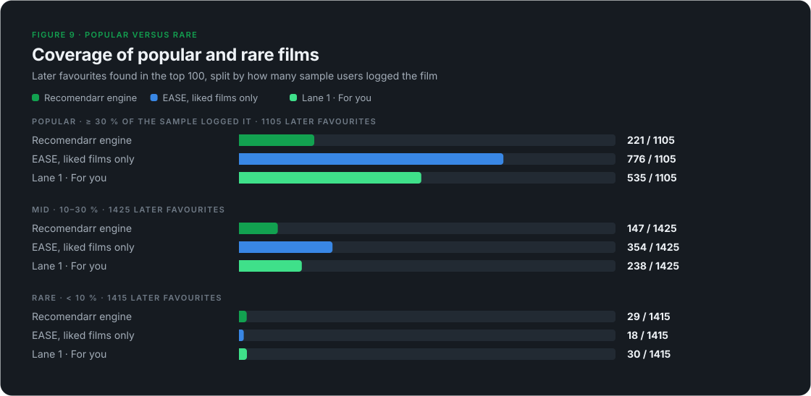

Split by how many of the 395 training users logged a film (fresh users):

| Later favourite is … | Positives | Engine | EASE (liked) | Lane 1 | Most watched |
| --- | ---: | ---: | ---: | ---: | ---: |
| Popular (≥ 30 %) | 841 | 155 | 534 | 355 | 373 |
| Mid (10–30 %) | 926 | 76 | 141 | 105 | 0 |
| Rare (< 10 %) | 805 | **14** | **1** | 3 | 0 |

About a third of later favourites are rare, and collaborative filtering
cannot reach them: a film few sample users logged has almost no weights. The
engine, which reads Letterboxd's labels rather than people, finds 14 of them.
That is little in absolute terms and still the best number in the row, in
both test groups (27 against 0 of 1,294 rare favourites for the first 100
test users). It is the measured case
for keeping the content engine next to EASE.

Retrieval remains the other limit. 30 % of the fresh users' positives ever
reach the engine's pool; adding EASE's top 300 raises that to 55 % (65 % for
the case profiles).

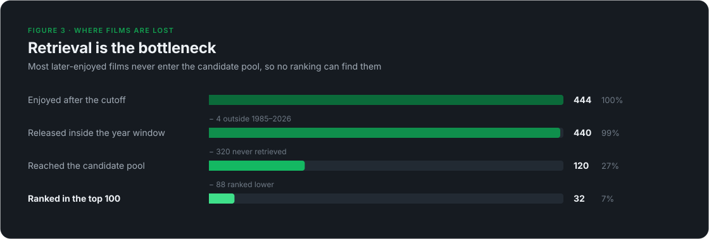

### 8.6 The lanes

**Lane 1, "For you"** reaches 18.0 % Recall@100 (4.6 % at 10), +8.5 pp
[+6.8, +10.3] over the engine, at a taste AUC of 0.731 against 0.740 for the
Letterboxd average alone. The product code matches the prototype it was
designed from (18.0 % on the same users). Its top 100 leans popular: the
median film was logged by 38 % of the sample, against 18 % for the engine.

**Lane 2, "Your taste"**, positives ≥ 3★ (3,381):

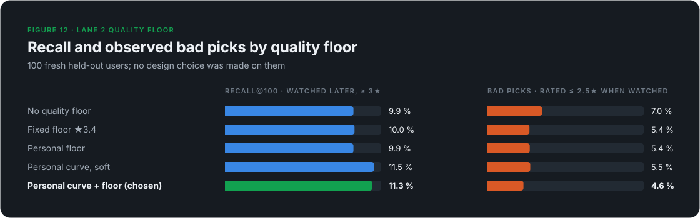

| Variant | Recall@100 | Bad picks (≤ 2.5★ when watched) |
| --- | ---: | ---: |
| No quality floor | 9.0 % | 36 of 340, 10.6 % |
| Fixed floor ★3.4 | 9.6 % | 18 of 340, 5.3 % |
| Personal floor | 9.1 % | 24 of 332, 7.2 % |
| Personal curve, soft | 10.9 % | 24 of 391, 6.1 % |
| **Personal curve + floor (chosen)** | **10.9 %** | **17 of 384, 4.4 %** |

The chosen variant was fixed on the first 100 test users. There its edge over
a fixed ★3.4 floor was not significant. On the fresh users it is: +1.3 pp
recall [+0.5, +2.3], with the fewest bad picks of all variants, and against
no floor +1.8 pp recall [+0.9, +2.8] at −6.2 pp bad picks [−8.8, −3.7]. The
personal floor also fits users as they are. It is ★3.0 for LEGACY, ★3.2 for
MIXTAPE and ★3.6 for NOIR:

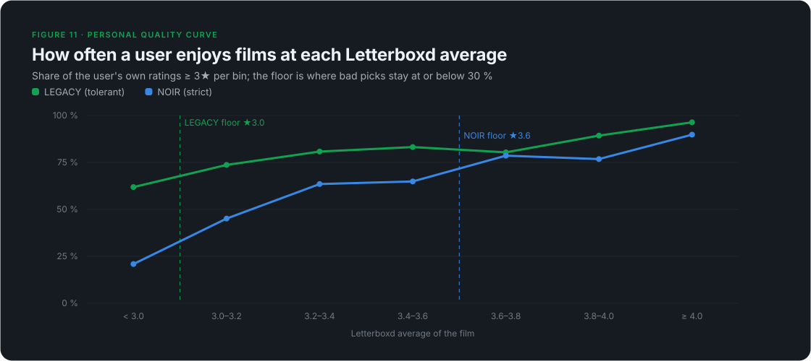

In the product, lane 2 leaves out lane-1 films. Its own recall then falls to
6.5 %, because its easiest hits are the popular films lane 1 already shows.
What matters is the combination: in a diagnostic run on 40 test users, both
lanes together held 27.9 % of later favourites with the exclusion and 26.6 %
without it, since the two lists then show 200 different films. On the fresh
users the two lanes together hold **25.4 %** (21.4 % of ≥ 3★ positives),
against 9.5 % for the engine's single list. Diversity (MMR) cost nothing
measurable in either lane and raised lane 1's Recall@10 from 4.1 % to 5.7 %
in the diagnostic run.

### 8.7 Ablations revisited

With three profiles v1 found no refinement that moved recall beyond noise.
On the 83 fresh users, against the full engine:

| Variant | Recall@100 | Difference [95 %] |
| --- | ---: | --- |
| Engine | 9.5 % | |
| Without neighbour signal | 7.8 % | −1.7 [−3.0, −0.5] |
| Core model only | 7.8 % | −1.7 [−3.0, −0.5] |
| Without IDF | 10.7 % | **+1.2 [+0.5, +1.9]** |
| Without diversity rerank | 9.6 % | +0.0 [−0.9, +0.9] |
| Without aversion penalty | 9.4 % | −0.1 [−0.4, +0.2] |
| Without favourite cluster | 9.2 % | −0.3 [−0.8, +0.3] |

The first 100 test users agree on the three clear rows (engine 10.2 %,
without neighbours 8.4 %, core model 8.2 %, without IDF 11.2 %). The neighbour signal
and the refinements as a whole measurably help. IDF measurably hurts: it only
boosts rare overlaps, while most later favourites are well-known films. v1
listed this as an open question; it is now the clearest single fix for the
engine (§10).

### 8.8 Threats to validity

- **Sample.** Member pages over-represent heavy loggers (median 852 films),
  and half the sampled profiles were reached via the case profiles' films.
  This helps the case profiles; the test users were drawn from both strata
  and never trained on.
- **Test users** are those with an active, rated diary (100 of 200 and 83 of
  163 checked), more engaged than a typical member.
- **Choices and headline data are separate**: every weight and floor was
  fixed on the first 100 test users; the fresh 83 were sampled afterwards.
  They were sampled from the same population by the same method, so they
  test generalisation to new users, not to other kinds of users.
- **Present-day data.** Sample libraries, Letterboxd averages and Similar
  lists were read in September 2026, after all test windows. In a pilot,
  9 of 89 EASE hits were films released after the fold's cutoff year: small,
  not zero.
- **Recall and AUC** carry opposite biases (§8.3) and neither measures
  discovery value. A user study would.
- **Growing catalog.** The cached catalog grew from 30,541 to 45,929 films
  while preparing the sample. The top-rated-catalog baseline for the case
  profiles fell from 8 to 4 hits as a result; no other number depends on
  catalog size.

## 9. Engineering

| Area | What it does |
| --- | --- |
| Stack | Python backend, Next.js frontend, SQLite, Docker |
| Catalog | about 51,000 films cached locally with their Letterboxd metadata |
| Collaborative model | EASE fitted monthly by a background job: refresh known sample users (about one page each), add new ones, refit (0.4 GB, seconds), activate only if the owner's own taste AUC does not drop; one row of 300 neighbour weights per film |
| Letterboxd access | public pages only, no login; one shared rate limit for all requests (1 request per second for the sample) and aggressive caching; a page that fails is skipped instead of aborting the run |
| Sample data | for each sampled member only film, rating and like; stored locally, used for this research and a private instance of the app; no usernames are published |
| Caches | diaries, watched lists, browse pages, Similar lists and finished runs are cached with separate lifetimes, so a repeat run takes seconds |
| Saved runs | every run is kept and can be exported as HTML, JSON, CSV or a Letterboxd import list |
| Tests | 486 automated backend tests and 21 frontend tests |

A live run with both lanes takes about two seconds on a warm cache.

Beyond personal recommendations, Recomendarr also offers a Year in Review,
all-time stats, similar-film recommendations ("more like this film"), film
pages and explorable theme, genre, mini-theme and director catalogs.

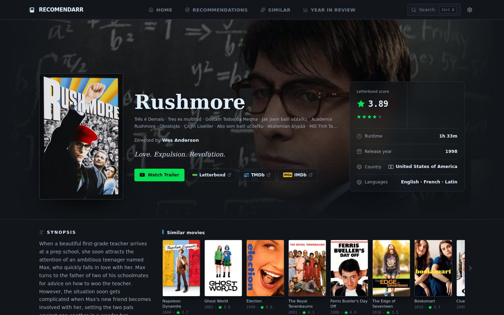

## 10. Limitations and next steps

In order of expected impact:

1. **Larger and different test users.** The 83 fresh users come from the
   same population as the first 100. Users with sparse or unrated diaries,
   and a larger fresh set, would show how far the result carries.
2. **Drop or cap IDF.** Removing it gains 1.7 pp recall [+0.7, +2.7] (§8.7).
3. **Weight the profile by love for retrieval.** The profile tracks habit
   (§3.5). Lane 2 wants that, but the engine's candidate pages might find
   more later favourites from a liked-films profile.
4. **Rare films.** They are two in five later favourites, and only the
   engine reaches any. Widening the engine's retrieval for rare labels, or
   a collaborative model with side information (themes as extra features),
   are the two directions.
5. **Similar to a film.** Pure co-watching gives weak "more like this"
   lists; EASE neighbours filtered by content similarity are the obvious
   next step for the anchor mode.
6. **A user study.** Neither test measures discovery; asking users which
   picks they would watch, and why, would.
7. **Relative aversion** and **mood evaluation** remain open from v1.

## Appendix A: formula sheet

```text
entry weight   w = 1 + 0.25·liked + 0.75·rewatch, then
                   +(r−3.5) if r≥4.5 | +0.5 if r=4.0 | ×0.6 if r=2.5 | ×0.3 if r≤2.0
per-film cap   Σw ≤ 4.0, Σfavourite ≤ 2.0, Σaversion ≤ 2.0 (entries scaled proportionally)
favourite      base(r) ∈ {1.0, 0.5, 0.3, 0} + 0.15·liked + rewatch bump, ≤ 1.4
aversion       r ≤ 2.0: 1.8 − 0.6·r (+0.3 if not liked and r ≤ 1.5), ×0.5 on rewatch

idf(t)         min(3.0, ln((N+1)/(df+1)) + 1)
theme          min(30, Σ max(0, 10−2r)·idf)
mini-theme     min(20, Σ max(0, 6−r)·idf)
genre          min(15, Σ max(0, 5−r)·idf)
director       P·max(0, 1−r/10), P ∈ {10, 7, 5}
actor          min(10, Σ P·max(0, 1−r/15)), P ∈ {2, 1.5, 1}
multi-source   min(12, 6·(S−1)) if S > 1
fav. cluster   min(18, dir 5·min(c,3) + themes ≤6 + minis ≤4 + actors ≤3)
neighbour      {1: 2.5, 2: 6, ≥3: 12} seeds
aversion       −min(15, director ≤6 + themes ≤3 + minis ≤1.5 + genres ≤1)   (≤ 11.5 in practice)

personal       min(100, Σ terms / 80 · 100)
quality        clamp(20·rating, 0, 100)
final          0.65·personal + 0.30·quality + 0.05·mood          (Personal mode)
MMR            λ·score/max − (1−λ)·max_sim, λ = 0.75, every 5th slot off-genre if one genre ≥ 70 %

liked          rating ≥ 3.5★, or liked when unrated
EASE           P = (XᵀX + λI)⁻¹, B = I − P·diag(1/diag(P)), λ = 1000   (X: users × films, liked = 1)
               via Woodbury when users < films; keep top 300 |B[j,·]| per film
ease(film)     Σ over liked films j of B[j, film]
pct(x)         rank percentile of x among the run's candidates, in (0, 1]
for you        0.5·pct(ease) + 0.5·pct(Letterboxd average)          (films EASE can score)
like(q)        per Letterboxd-average bin: (#rated ≥ 3★ + 10·overall rate) / (#rated + 10)
floor          lowest bin edge from which every higher bin has < 30 % rated ≤ 2.5★
your taste     0.5·pct(taste terms) + 0.25·pct(ease) + 0.25·pct(like(q)),   average ≥ floor
lanes          MMR as above, 50 films each; lane 2 leaves out lane-1 films
```

## Appendix B: glossary

| Term | Meaning here |
| --- | --- |
| Candidate pool | The de-duplicated films collected from the source pages and neighbours for one run |
| Source page | A Letterboxd browse page (theme, mini-theme, genre, director or actor), sorted by rating |
| Theme / mini-theme | Letterboxd's story and tone labels; mini-themes are the narrower level |
| Favourite cluster | Signals that recur in films the user rated 3.5★ or higher, weighted towards 4.5★+ |
| Seed film | One of the user's strongest favourites (top 12 by default), used to read Letterboxd Similar lists |
| Neighbour signal | How many seed films list a candidate as similar |
| IDF | Inverse document frequency: how rare a label is in the current pool |
| MMR | Maximal marginal relevance: a greedy rerank trading relevance against similarity to what is already picked |
| Recall@K | Share of held-out positives found in the top K |
| AUC | In the taste test: probability that a liked film outranks a not-liked one; 0.5 is chance |
| EASE | Embarrassingly Shallow Autoencoders: a linear item-item collaborative model with a closed-form fit |
| Lane | One of the two result lists: "For you" (EASE + Letterboxd average) or "Your taste" (engine profile + quality curve) |
| Personal quality curve | How often a user enjoys films at each Letterboxd average, learned from their own ratings |
| Sample | The 500 public profiles behind the collaborative model |
| Test user | A sampled user with an active, rated diary, held out of the model and used for evaluation |
| First / fresh test users | The 100 test users all design choices were made on, and the 83 sampled afterwards that give the headline numbers |
| Popularity share | Share of the sample's training users who logged a film |
| Positive | In the holdout: a first watch after the cutoff rated 3.5★ or higher (or liked, if unrated); 3★ for lane 2 |
| Herfindahl index | Sum of squared shares; here, how concentrated the list is on a few directors |
