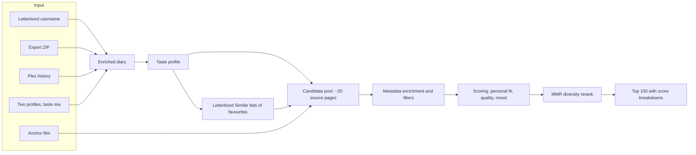
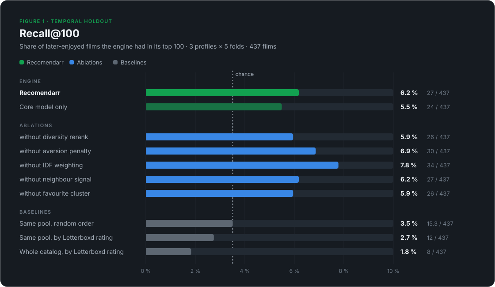
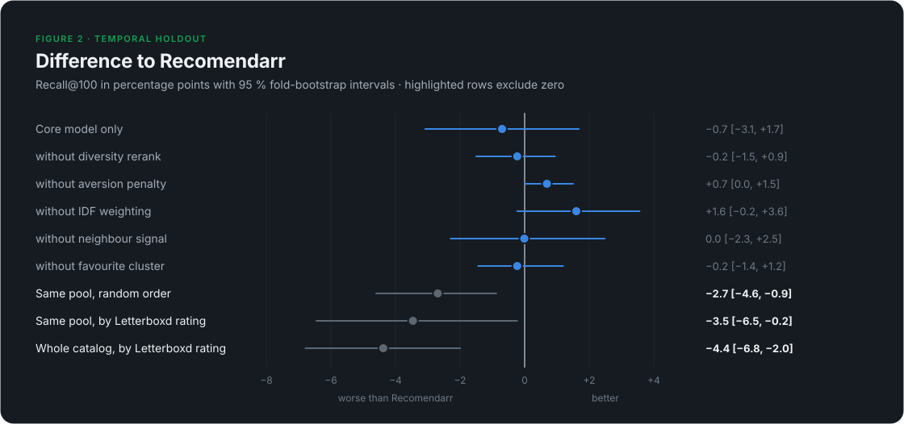

# How Recomendarr Recommends Films

**An explainable, Letterboxd-native recommender: design, scoring model and a temporal holdout evaluation**


## Abstract

Recomendarr turns a Letterboxd diary into a ranked list of films the user has
not seen, and shows the reason behind every point of every score. It does not
learn embeddings or a neural ranker. It builds a weighted taste profile from
ratings, likes and rewatches, uses that profile to pick about 20 Letterboxd
pages as a candidate pool, adds films Letterboxd lists as similar to the
user's favourites, and ranks the pool with a small set of capped, additive
terms. A diversity pass then reorders the list.

We test the engine the way it runs in the web app, on three public profiles
with different tastes. In a temporal holdout (train on the diary up to a
date, try to predict the films the user first watched and enjoyed
afterwards), the engine puts **6.2 %** of those films in its top 100. Random
order over the same pool would find **3.5 %**, sorting it by Letterboxd
rating finds **2.7 %**, and the highest-rated films of the whole 30,541-film
catalog find **1.8 %**. The engine leads on all three profiles, and each gap
lies outside a fold-bootstrap interval. The refinements added on top of the
core taxonomy model (IDF weighting, aversion penalty, favourite cluster,
neighbour signal, diversity) do not move Recall@100 by a clear margin, alone
or together, and two of them point slightly the wrong way. The bigger limit
is retrieval: only 27 % of the films users later enjoyed ever reach the
candidate pool.

## Key findings

1. **The engine beats rating and random baselines, 1.8–3.4×.** 27 of 437
   later-enjoyed films land in the top 100, against an expected 15.3 for
   random order over the same pool, 12 for that pool sorted by rating and 8
   for the top-rated catalog.
2. **Retrieval, not ranking, is the bottleneck.** Of the 437 films, 118
   reached the pool. The ranker put 27 of those (22.9 %) into the top 100,
   about 1.8 times what a random order of the pool would.
3. **The refinements are not yet proven.** No ablation changes Recall@100
   beyond noise, and the core taxonomy model alone (24 hits) is statistically
   indistinguishable from the full engine. Turning the aversion penalty off
   helps a little (30 vs 27), turning IDF off a little more (34 vs 27, on all
   three profiles). Both stay documented as open questions, not settled wins.
4. **Every score is auditable.** The final score of LEGACY's top
   pick, *Rushmore*, follows from its published terms to the decimal (§7.3).
   It also entered the pool only through Letterboxd's own similar-film lists.

## Contents

1. [The problem](#1-the-problem)
2. [System overview](#2-system-overview)
3. [The taste profile](#3-the-taste-profile)
4. [Candidate generation](#4-candidate-generation)
5. [Scoring](#5-scoring)
6. [Reranking and modes](#6-reranking-and-modes)
7. [Three case studies](#7-three-case-studies)
8. [Evaluation](#8-evaluation)
9. [Engineering](#9-engineering)
10. [Limitations and next steps](#10-limitations-and-next-steps)
- [Appendix A: formula sheet](#appendix-a-formula-sheet)
- [Appendix B: glossary](#appendix-b-glossary)

## 1. The problem

Movie metadata looks plentiful, and naive recommenders built on it tend to
fail in one of three ways:

- **Over-generalisation.** "Likes comedy" describes someone who loves
  slapstick and someone who loves deadpan equally well. Broad labels flatten
  taste.
- **Popularity drift.** When global rating dominates, the list turns into
  "good films" rather than "films for this person". Our holdout agrees: the
  two rating-ordered baselines are the weakest we measured.
- **Opacity.** "People like you liked this" is a poor answer for a product
  whose value is showing what it understood about you.

Recomendarr's answer is to spend the effort on two separate problems. First,
pick the right few hundred candidates from the user's strongest signals.
Second, rank them with terms a person can read.

## 2. System overview



Every entry point runs the same core pipeline and differs only in where the
diary and the candidates come from:

| Entry point | Diary source | Candidate source |
| --- | --- | --- |
| Live username | the public diary and Films page | public Letterboxd pages |
| Letterboxd export ZIP | uploaded CSVs | local catalog cache |
| Plex history | Plex login + Tautulli, matched by title, year, TMDB/IMDb id | local catalog cache |
| Taste mix | two of the above, blended | live if any Letterboxd profile is involved |
| Similar to a film ("anchor") | optional username | anchor's own taxonomy + Similar list |

This paper describes the **live username flow with the app's default
settings**, which is what users see, including the default year window of
1985 to the current year.

## 3. The taste profile

The profile is the engine's picture of the user, and everything downstream
inherits its quality. It is built from diary entries enriched with
Letterboxd metadata (genres, themes, mini-themes, directors, actors).

### 3.1 Entry weight

Each diary entry gets a weight before it is added to its film's genres,
themes, mini-themes and people:

| Component | Effect |
| --- | --- |
| Base | 1.0 |
| Liked | +0.25 |
| Rewatch | +0.75 |
| Rating ≥ 4.5★ | + (rating − 3.5) |
| Rating 4.0★ | +0.5 |
| Rating 2.5★ | × 0.6 |
| Rating ≤ 2.0★ | × 0.3 |

A 5★ liked rewatch weighs 3.5, a plain 3★ watch 1.0 and a 1.5★ watch 0.3.

### 3.2 Per-film cap

Repeat watches add up, but **each film contributes at most 4.0 profile
weight**. If a film's entries sum to more, every entry is scaled by
`4.0 / total`. Favourite and aversion weights (below) are capped the same way
at 2.0 per film. Without this cap one comfort film could define the profile.

*The Big Lebowski* shows the effect. LEGACY logged it six times, mostly
4.5–5★ liked rewatches. Uncapped, those entries would add 17.75 to *Crude
humor and satire*, *Comedy* and Joel Coen, and 7.75 to the favourite cluster.
Capped, they add 4.0 and 2.0. Joel Coen dropped from the top director slot to
third as a result.

### 3.3 Favourite and aversion signals

Two further weights feed separate signal clusters:

```text
favourite: base 1.0 (≥4.5★), 0.5 (4.0★), 0.3 (3.5★), else 0
           +0.15 if liked; +0.35 on rewatch (≥4.0★) or +0.2 otherwise; max 1.4
aversion:  only for ratings ≤ 2.0★: 1.8 − 0.6 · rating
           +0.3 if explicitly not liked and ≤ 1.5★; × 0.5 on rewatch
```

The **favourite cluster** records which directors, themes, mini-themes and
actors recur in the films the user loved, as opposed to the films they merely
watched a lot. The films with the highest favourite weight become **seed
films** for the neighbour signal (§4.2). The **aversion cluster** records the
same for films rated 2★ or lower. Entries that are aversion-only do not feed
the positive director and actor lists at all.

A single low-rated entry shows the asymmetry. *Date Movie* (1.5★, not liked)
shares every comedy label with LEGACY's favourites, but it adds only
0.3 to the positive profile and 1.2 to the aversion cluster.

### 3.4 What the profile contains

The output holds weighted top lists (10 genres, 15 themes, 15 mini-themes,
15 directors, 20 actors, 10 countries), the favourite and aversion clusters
and the seed films. For LEGACY (609 enriched diary entries) the top of
the profile reads:

| Layer | Top entries (weighted score) |
| --- | --- |
| Themes | Crude humor and satire 412.9 · Relationship comedy 124.4 · Underdogs and coming of age 106.8 |
| Mini-themes | Gags, jokes, and slapstick humor 353.9 · Funny jokes and crude humor 326.6 · Amusing jokes and witty satire 260.5 |
| Genres | Comedy 455.6 · Adventure 159.6 · Drama 149.0 |
| Directors | Edgar Wright 10.8 · Makoto Shinkai 10.5 · Joel Coen 8.5 |
| Favourite themes | Crude humor and satire 84.5 · Relationship comedy 28.1 · Humanity and the world around us 27.3 |

## 4. Candidate generation

The ranker never sees the whole catalog. It sees a pool built from the
profile, which is the most consequential design decision in the system, as
§8.3 shows.

### 4.1 Source pages

The web app requests the **top 5 themes, top 3 mini-themes, top 5 genres,
top 3 directors and top 4 actors**, 20 Letterboxd pages in all, each browsed
by rating and capped at 72 films. A mood preset adds up to six more pages
(two genres, two themes, two mini-themes of the preset). Watched films are
skipped while collecting. Each film keeps a list of the pages that surfaced
it, which later feeds the multi-source bonus and the explanations.

### 4.2 Letterboxd neighbours

Letterboxd publishes a "Similar films" list per film. For the top 12 seed films
the engine reads up to 100 entries of that list and counts, for every
candidate, how many seeds list it. Films already in the pool get that count;
films not yet in the pool are added. This is the system's only collaborative
signal, and it is deliberately narrow: it is Letterboxd's item similarity
around films the user loved, not a user-user model.

For LEGACY the neighbour step added 330 films to the pool and boosted
29 that were already there.

### 4.3 Enrichment and filters

Every candidate is enriched from a local metadata cache, or read from its
public Letterboxd page on a miss. The engine then drops:

- watched films (the full diary plus the Films page; a stale cached Films
  page is used if Letterboxd is unreachable, and with no copy at all the run
  fails instead of risking watched films in the output)
- TV entries (the TMDB link points to `/tv/`)
- anything under 20 minutes, outside the year window (app default
  1985–current year) or outside an optional runtime window

Trailers, bonus material and similar listings are not dropped but take a
−18 penalty (§5.1).

| Profile | Pages | Unique candidates (incl. neighbours) | of which neighbour-added | Ranked after filters |
| --- | ---: | ---: | ---: | ---: |
| LEGACY | 20 | 1,029 | 330 | 778 |
| NOIR | 20 | 808 | 296 | 571 |
| MIXTAPE | 20 | 1,325 | 545 | 1,029 |

## 5. Scoring

Each surviving film gets three scores on a 0–100 scale: **personal fit**,
**quality** and **mood**. A blend of the three gives the final score.

### 5.1 Personal fit

Personal fit is a sum of capped, additive terms. A term matches either by
name on the film or by the slug of the source page that surfaced it. `r` is
the 0-based rank of the matched item in the user's top list, and `idf` is the
pool-local rarity weight from §5.2.

| Term | Points | Cap |
| --- | --- | ---: |
| Theme match | Σ max(0, 10 − 2r) · idf, over matched themes | 30 |
| Mini-theme match | Σ max(0, 6 − r) · idf | 20 |
| Genre match | Σ max(0, 5 − r) · idf | 15 |
| Director match | P · max(0, 1 − r/10) for the first of the film's directors found in the user's list. P = 10 with a theme/mini-theme match, 7 with only a genre match, 5 otherwise | 10 |
| Actor match | Σ P · max(0, 1 − r/15). P = 2 / 1.5 / 1, same context rule | 10 |
| Multi-source bonus | 6 · (S − 1) when S > 1. S sums source-type weights over the film's unique pages: theme 1.0, mini-theme 0.85, genre 0.65, director 0.35, actor 0.25, other (incl. neighbour) 0.4 | 12 |
| Favourite cluster | 5 · min(c, 3) for a shared favourite director; 1.5 · min(c, 4) per theme (≤ 6); 1.0 · min(c, 4) per mini-theme (≤ 4); 1.0 · min(c, 3) per actor (≤ 3). c = summed favourite weight | 18 |
| Neighbour match | 2.5 / 6 / 12 when 1 / 2 / ≥ 3 seed films list the candidate | 12 |
| Aversion penalty | director with aversion ≥ 2.0 → 6 (≥ 1.5 → 1.5); +1.0 per theme ≥ 3.0 (≤ 3); +0.5 per mini-theme ≥ 3.0 (≤ 1.5); +0.5 per genre ≥ 4.5 (≤ 1); at most 11.5 in practice | −15 |
| Promo penalty | −18 for trailers, bonus material and similar listings | — |

People terms deliberately depend on context. A shared director is worth
twice as much when the film already matches the user's themes, so a
favourite actor alone cannot carry an off-taste film.

The total is normalised with a fixed divisor:

```text
personal = min(100, personal_total / 80 · 100)
```

The theoretical maximum is about 127, so a film saturates at 100 once it
collects 80 points. That keeps ordinary matches well below 100, but it also
means several top films tie at 100 (§10).

### 5.2 Pool-local IDF

Theme, mini-theme and genre points are multiplied by a rarity weight
computed over the filtered pool of the current run:

```text
idf(term) = min(3.0, ln((N + 1) / (df + 1)) + 1)      (N = pool size, df = films with the term)
```

The weight runs from 1.0 for a label every candidate shares up to 3.0 for
rare ones, so IDF only ever boosts rare overlaps. In a comedy-heavy pool
*Comedy* stays near 1.0 while a rare mini-theme can approach 3.0. The caps
still apply after the multiplication.

### 5.3 Quality

```text
quality = clamp(letterboxd_rating · 20, 0, 100)      (0 if unrated)
```

This is the only place the global rating enters the score. It is used on
its fixed five-star scale rather than as a percentile within the pool,
which would exaggerate tiny rating differences.

### 5.4 Mood

Mood presets (14 moods, 17 vibes and a neutral "all") map to real genres, themes and mini-themes:

```text
mood = clamp(8·genre_hits (≤24) + 14·theme_hits (≤42) + 10·mini_hits (≤30) − 12·avoid_hits (≤36), 0, 100)
```

Hard gates stop broad matches. Eight presets (angry, tense, teen comedy,
revenge, noir, fighting, heist, adrenaline) score 0 unless one of their
defining mini-themes matches. *Romcom* needs both Comedy and Romance. Stoner,
superheroes, horny and heist additionally check the title and description for
keywords. With the neutral preset, mood is 0.

### 5.5 Blend

| Mode (UI label) | Final score |
| --- | --- |
| Personal (default) | 0.65 · personal + 0.30 · quality + 0.05 · mood |
| Taste & mood | 0.35 · personal + 0.40 · mood + 0.25 · quality |
| Mood first | 0.65 · mood + 0.30 · quality + 0.05 · personal |

Films below a final score of 15 are dropped. Picking a mood switches the app
to *Taste & mood* and drops films whose mood score is below 30.

### 5.6 Explanations

Each recommendation ships its full breakdown and the preferences it matched,
and the interface turns both into plain language: why the film is there,
how the score adds up, and which of the user's tastes it touches.


## 6. Reranking and modes

### 6.1 Diversity (MMR)

The engine scores the top 800 films (limit 100 × pool multiplier 8) and
reorders them with maximal marginal relevance:

```text
pick next = argmax  λ · score/score_max − (1 − λ) · max similarity to already picked     (λ = 0.75)
similarity = weighted Jaccard: directors 0.40, mini-themes 0.25, themes 0.20, genres 0.15
```

On top of that, if one genre covers at least 70 % of the pre-rerank top 100,
**every fifth slot** is reserved for the best film without that genre, as
long as it scores within 30 points of the leader. For LEGACY this is
why *The Lord of the Rings: The Return of the King* (74.8) sits at rank 5 and
*Interstellar* (69.5) at rank 10 between comedies scoring 83–88. Scores are
never changed by the rerank, only positions. Director concentration
(Herfindahl index) falls from 0.0156 to 0.0116 for LEGACY and from
0.0222 to 0.0122 for MIXTAPE.

### 6.2 Similar to a film

Given an anchor film, the pool also pulls the anchor's themes, mini-themes
and top two directors, and the anchor becomes seed number one (user seeds are
cut to 6). An anchor score rewards films on the anchor's Similar list
(neighbour tier × 2) and shared taxonomy
(4 per theme + 2.5 per mini-theme + 5 per director, capped at 16 and halved
off the Similar list), normalised by 30. With the default *balanced*
strength, final = 0.4 · blend + 0.6 · anchor. Without a username the profile
is empty, so the list is driven by the anchor alone.

### 6.3 Taste mix

Two profiles (Letterboxd and/or Plex) are merged by normalised rank, so a
long diary cannot drown out a short one, and items both people share rank
first. Favourite signals keep only what both share (minimum weight); aversion
keeps what either dislikes (maximum weight). Neighbour seeds interleave
shared favourites first, then each person's.

## 7. Three case studies

We use three public Letterboxd profiles with different tastes, shown under
pseudonyms: LEGACY is the author's own profile, NOIR and MIXTAPE belong to
two volunteers. All runs use the app's default settings and the 1985–2026
window.


| | LEGACY | NOIR | MIXTAPE |
| --- | --- | --- | --- |
| Enriched diary entries | 609 | 1,256 | 746 |
| Watched films excluded | 633 | 3,695 | 770 |
| Leading theme | Crude humor and satire | Moving relationship stories | Moving relationship stories |
| Leading mini-theme | Gags, jokes, and slapstick humor | Twisted dark psychological thriller | Twisted dark psychological thriller |
| Top directors | Edgar Wright, Makoto Shinkai, Joel Coen | Yorgos Lanthimos, Wes Anderson, Ari Aster | Yorgos Lanthimos, Wes Anderson, Luca Guadagnino |
| Diary entries rated ≤ 2★ (aversion entries) | 39 | 357 | 188 |

### 7.1 Top recommendations

| Rank | LEGACY | NOIR | MIXTAPE |
| ---: | --- | --- | --- |
| 1 | Rushmore (1998) · 88.3 | Cure (1997) · 90.7 | Parasite (2019) · 92.2 |
| 2 | The Lego Batman Movie (2017) · 86.6 | Monster (2023) · 89.3 | Evil Dead II (1987) · 87.6 |
| 3 | The Ballad of Buster Scruggs (2018) · 86.9 | Sympathy for Mr. Vengeance (2002) · 83.9 | The Silence of the Lambs (1991) · 91.0 |
| 4 | After Hours (1985) · 86.1 | The Strange Thing About the Johnsons (2011) · 83.8 | The Royal Tenenbaums (2001) · 89.7 |
| 5 | The Lord of the Rings: The Return of the King (2003) · 74.8 | Chainsaw Man – The Movie: Reze Arc (2025) · 78.3 | Avengers: Endgame (2019) · 86.7 |

Rank order and score order differ because of the rerank (§6.1). The lists
follow each profile: slapstick and comic chaos for LEGACY, dark
psychological cinema for NOIR, a mix of horror, prestige drama and
blockbusters for MIXTAPE.

### 7.2 What the top 10 is made of


Averaged over LEGACY's top 10, the terms are: theme 24.3, mini-theme
16.0, genre 13.6, favourite cluster 15.2, multi-source 4.5, neighbour 3.5,
director 1.1, actor 0.9 and aversion −2.9. Personal fit averages 91.7 and
quality 80.1. The list is won by themes and the favourite cluster, not by
familiar names.

### 7.3 One recommendation, end to end: *Rushmore*

1. **Retrieval.** *Rushmore* is on none of the 20 source pages. It entered
   the pool because Letterboxd lists it as similar to two of LEGACY's
   seed films, *Ferris Bueller's Day Off* and *The Big Lebowski*.
2. **Personal fit.** It carries the user's top three themes (theme term at its
   cap of 30), enough top mini-themes to reach that cap too (20), and Comedy
   and Drama (genre 14.0 after IDF). It shares enough favourite signals to hit the
   cluster cap of 18. Two seeds give neighbour 6.0. The aversion penalty costs
   −5.0: the maximum 3.0 for themes plus mini-themes and genres the user also
   often rates low (§8.4).

   ```text
   personal_total = 30 + 20 + 14.0 + 18 + 6 − 5 = 83.0
   personal       = min(100, 83.0 / 80 · 100) = 100
   ```

   The multi-source bonus is 0: its only source is the neighbour row
   (weight 0.4 < 1). The theme, mini-theme and genre values include this
   run's pool-local IDF weights; the steps below start from those terms.
3. **Quality.** Letterboxd rating 3.89 → 3.89 · 20 = 77.8.
4. **Blend.** `0.65 · 100 + 0.30 · 77.8 + 0.05 · 0 = 65.0 + 23.3 = 88.3`.
5. **Explanation.** "Shares signals with your top-rated films · Letterboxd
   lists this near several of your favorites · Matches your top themes: Crude
   humor and satire, Underdogs and coming of age".


## 8. Evaluation

### 8.1 Method

A temporal holdout asks the question that matters: given what the user had
watched up to a date, would the engine have suggested the films they went on
to enjoy?

- Each dated diary is cut into **five consecutive test windows**, each 10 %
  of the diary (together the most recent half). Each fold trains on all
  entries before its window.
- **Positives** are first watches inside the window: not marked as a rewatch,
  not in the training diary, and rated at least 3.5★ (or liked, if unrated).
- At the cutoff, everything logged after it counts as unseen. Films on the
  Films page without a diary date stay excluded, since we cannot date them.
- The engine runs the full app pipeline on the training history (profile,
  20 pages, neighbours, enrichment, the app's config) and returns its top 100.
- **Variants** rank the same pool, so they differ only in ranking. The two
  exceptions remove the neighbour step completely, including the films only
  neighbours brought in: *without neighbours*, and *core model only*, which
  also switches off IDF, aversion, the favourite cluster and MMR.
- **Baselines**: the same pool sorted by Letterboxd rating; the exact
  expected result of a random order of that pool; and the 100 highest-rated
  feature films of the whole cached catalog (1985–2026, at least 40 minutes).
- We report Recall@K micro-averaged over the 15 folds, and 95 % intervals
  from 10,000 bootstrap resamples of folds.

### 8.2 Results





Per profile, the engine finds 12 / 125 (LEGACY), 11 / 168 (NOIR)
and 4 / 144 (MIXTAPE), against an expected 5.3, 6.7 and 3.3 for random
order and 6, 3 and 3 for rating order. It leads on every profile, though only
narrowly on MIXTAPE.

### 8.3 Retrieval is the bottleneck


Only 118 of the 437 positives (27 %) were in the ranked pool of their fold
(34 % for LEGACY, 24 % for NOIR and MIXTAPE). No ranking
change can recover the other 73 %. Among reachable films the ranker does its
job: 27 of 118 (22.9 %) make the top 100, against 15.3 expected from a
random order of the same pools, about 1.8 times chance.

### 8.4 What the ablations say

- **The core model carries the result.** Taxonomy terms, people, source
  overlap and quality, with every refinement off, find 24 films: still above
  every baseline and within noise of the full engine.
- **Aversion penalises the wrong things.** Its thresholds are absolute (a
  theme needs an aversion weight of 3.0), so a user who watches a lot in one
  lane trips them in that very lane. LEGACY's strongest aversion theme
  is Crude humor and satire (22.8), which is also their strongest positive
  theme (412.9). 88 of LEGACY's top 100 and all 100 for the other two
  profiles carry a penalty. Removing it gains 2 hits for LEGACY, 1 for
  MIXTAPE and none for NOIR. The fix is to judge aversion relative
  to positive weight (§10).
- **IDF may push too far towards niche films.** It only ever boosts rare
  overlaps, but users mostly watch well-known films. Removing it helped all
  three profiles a little (+2, +4, +1). We keep it for now because it makes
  explanations more specific, but the evidence does not favour it.
- **No measurable neighbour effect.** Removing the neighbour step entirely,
  pool contribution included, changes the top 50 (20 → 16) but not the top
  100. Individual wins exist (our case-study #1 only reached the pool through
  neighbours), but at this sample size they do not add up to a measurable
  gain.
- **MMR costs nothing measurable.** Recall stays the same while the director
  Herfindahl index falls by 23–45 %. For LEGACY that is 64 → 86
  effective directors in the top 100.

### 8.5 Threats to validity

- **Small, clustered sample.** Three profiles and 437 positives. The folds
  are not independent (three users, nested training sets), so the bootstrap
  intervals are optimistic, and eight comparisons are made without
  correction. Treat the baseline gaps as consistent evidence, not as a
  precise effect size, and differences under about two points as noise.
- **Tuning profile.** LEGACY is the developer's own profile and was
  used to tune the refinements in May 2026. It supplies 12 of the 27 hits.
  The other two profiles were not used for tuning.
- **Recall undercounts quality.** A good recommendation the user has not
  watched yet counts as a miss. Holdout recall measures prediction of
  behaviour, not satisfaction.
- **Present-day data.** Letterboxd ratings, browse pages and Similar lists
  were read in September 2026, after all test windows. They are aggregate
  signals, but a small leak through the users' own ratings in those averages
  cannot be ruled out.
- **Catalog baseline bias.** The cached catalog over-represents films that
  earlier runs touched, which favours that baseline, not the engine.

## 9. Engineering

| Area | What it does |
| --- | --- |
| Stack | Python backend, Next.js frontend, SQLite, Docker |
| Catalog | 30,541 films and 5,899 Letterboxd Similar lists cached locally |
| Letterboxd access | reads public pages only, gently: one shared rate limit for all requests and aggressive caching; a page that fails is skipped instead of aborting the run |
| Caches | diaries, watched lists, browse pages, Similar lists and finished runs are cached with separate lifetimes, so a repeat run takes seconds |
| Saved runs | every run is kept and can be exported as HTML, JSON, CSV or a Letterboxd import list |
| Tests | 438 automated backend tests |

Beyond personal recommendations, Recomendarr also offers a Year in Review,
all-time stats, similar-film recommendations ("more like this film"), film
pages and explorable theme, genre, mini-theme and director catalogs.


## 10. Limitations and next steps

In order of expected impact:

1. **Widen retrieval.** 73 % of later-enjoyed films never reach the pool.
   Candidates: more neighbour seeds and deeper Similar lists, pages for the
   favourite cluster rather than only the aggregate top lists, and recency-
   and popularity-sorted pages next to rating-sorted ones.
2. **Relative aversion.** Penalise a theme only when its aversion weight is a
   meaningful share of its positive weight, then re-run the holdout.
3. **Revisit IDF and saturation.** Test a lower IDF ceiling, and a divisor
   or curve that does not tie many top films at personal fit 100.
4. **More profiles and metrics.** Ten or more profiles, a second positive
   threshold (4★+), and a user-facing "would you watch this?" study.
5. **Mood and anchor evaluation.** This paper evaluates only the default
   mode.

## Appendix A: formula sheet

```text
entry weight   w = 1 + 0.25·liked + 0.75·rewatch, then
                   +(r−3.5) if r≥4.5 | +0.5 if r=4.0 | ×0.6 if r=2.5 | ×0.3 if r≤2.0
per-film cap   Σw ≤ 4.0, Σfavourite ≤ 2.0, Σaversion ≤ 2.0 (entries scaled proportionally)
favourite      base(r) ∈ {1.0, 0.5, 0.3, 0} + 0.15·liked + rewatch bump, ≤ 1.4
aversion       r ≤ 2.0: 1.8 − 0.6·r (+0.3 if not liked and r ≤ 1.5), ×0.5 on rewatch

idf(t)         min(3.0, ln((N+1)/(df+1)) + 1)
theme          min(30, Σ max(0, 10−2r)·idf)
mini-theme     min(20, Σ max(0, 6−r)·idf)
genre          min(15, Σ max(0, 5−r)·idf)
director       P·max(0, 1−r/10), P ∈ {10, 7, 5}
actor          min(10, Σ P·max(0, 1−r/15)), P ∈ {2, 1.5, 1}
multi-source   min(12, 6·(S−1)) if S > 1
fav. cluster   min(18, dir 5·min(c,3) + themes ≤6 + minis ≤4 + actors ≤3)
neighbour      {1: 2.5, 2: 6, ≥3: 12} seeds
aversion       −min(15, director ≤6 + themes ≤3 + minis ≤1.5 + genres ≤1)   (≤ 11.5 in practice)

personal       min(100, Σ terms / 80 · 100)
quality        clamp(20·rating, 0, 100)
final          0.65·personal + 0.30·quality + 0.05·mood          (Personal mode)
MMR            λ·score/max − (1−λ)·max_sim, λ = 0.75, every 5th slot off-genre if one genre ≥ 70 %
```

## Appendix B: glossary

| Term | Meaning here |
| --- | --- |
| Candidate pool | The de-duplicated films collected from the source pages and neighbours for one run |
| Source page | A Letterboxd browse page (theme, mini-theme, genre, director or actor), sorted by rating |
| Theme / mini-theme | Letterboxd's story and tone labels; mini-themes are the narrower level |
| Favourite cluster | Signals that recur in films the user rated 3.5★ or higher, weighted towards 4.5★+ |
| Seed film | One of the user's strongest favourites (top 12 by default), used to read Letterboxd Similar lists |
| Neighbour signal | How many seed films list a candidate as similar |
| IDF | Inverse document frequency: how rare a label is in the current pool |
| MMR | Maximal marginal relevance: a greedy rerank trading relevance against similarity to what is already picked |
| Recall@K | Share of held-out positives found in the top K |
| Positive | In the holdout: a first watch after the cutoff rated 3.5★ or higher (or liked, if unrated) |
| Herfindahl index | Sum of squared shares; here, how concentrated the list is on a few directors |
