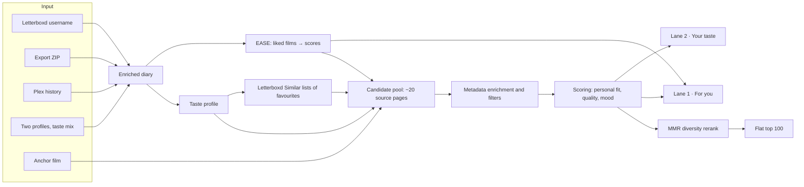
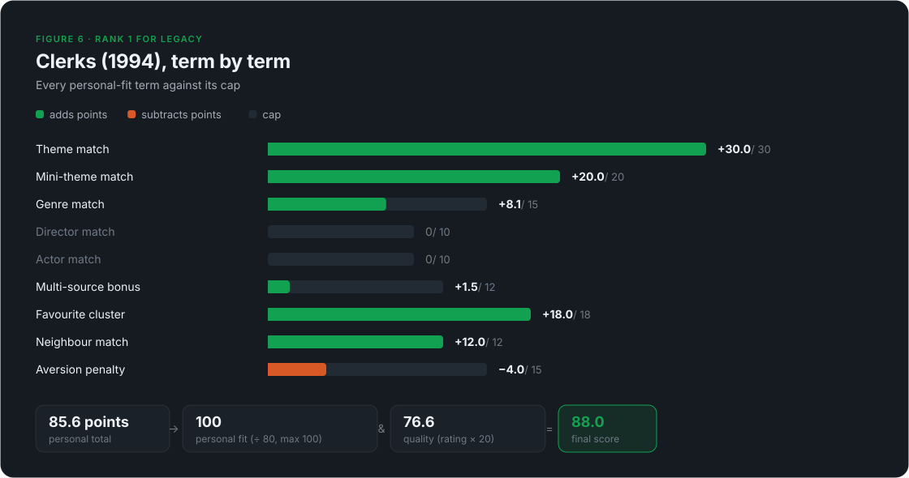
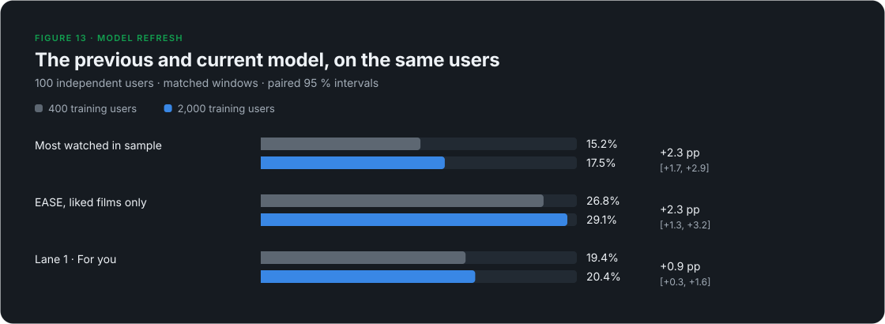

# How Recomendarr Recommends Films

**An explainable Letterboxd recommender, what stronger baselines revealed about it, and the two-lane design that followed**


## Abstract

Recomendarr turns a Letterboxd diary into recommendations with an explanation
for each pick. Its content engine follows the user's themes, genres and
favourites; a collaborative EASE model supplies a second source of evidence.
The product shows two lanes: **"For you"** (co-liking and community quality)
and **"Your taste"** (the content profile and a personal quality floor).

This September 30, 2026 refresh evaluates the current **2,000-user,
15,000-film model (λ = 2000)** on **100 newly collected independent users**.
Their 200 temporal test windows contain 3,945 later first
watches rated ≥ 3.5★ or liked when unrated. The older 183 evaluation users
are development data: 100 now overlap production training, and all 183 were
used to retune λ. They cannot independently confirm the updated model.

On the new users, the engine finds **10.1 %** of later
favourites in its top 100, popularity 17.5 %,
and EASE on liked films **29.1 %**.
"For you" reaches **20.4 %**; both lanes
cover **27.4 %**, with up to 200 films rather
than one list of 100.

A paired replay of the original 400-training-user model (500 collected,
λ = 1000) on the same users changes EASE Recall@100 from
26.8 % to
29.1 %: **+2.3 [+1.3, +3.2] percentage
points**, with a 95 % interval resampling whole users. This compares two
complete model configurations; sample size, sampling mix, λ and film coverage
changed together.

A second test separates liked from other rated first watches among films
both watched- and liked-signal models can score. The Letterboxd average
reaches AUC 0.758, stored EASE 0.686,
and the engine 0.577. Neither retrospective test measures the value
of discovering a film the user would never otherwise watch.

## Key findings

1. **The model refresh is now measured on independent users.** The paired
   comparison in §8.9 uses identical people, windows and positives for both
   snapshots, with a frozen metadata/source cache.
2. **Recall and taste answer different questions.** EASE Recall@100 is
   29.1 %; its stored-model taste AUC is
   0.686. Community rating reaches
   0.758 on taste, but only
   5.2 % recall on the engine's pool.
3. **The content profile still measures viewing habits.** Its taste terms
   reach AUC 0.530, and 0.522
   within quality terciles. They serve the "Your taste" lane.
4. **Rare-film coverage remains limited.** Of
   1,415 later favourites watched by
   fewer than 10 % of training users, the engine finds
   29, EASE
   18, and "For you"
   30.
5. **Report the floor's tradeoff, not just recall.** A personal curve plus
   floor reaches 11.3 % on ≥ 3★
   positives; 4.6 % of its
   retrospectively watched recommendations were rated ≤ 2.5★. §8.6 reports
   denominators and intervals.
6. **No fresh-data retuning.** Lane weights, λ, caps, floor rule and engine
   settings were frozen before collecting these 100 users. Ablations are
   diagnostics, not newly selected production settings.

## Contents

1. [The problem](#1-the-problem)
2. [System overview](#2-system-overview)
3. [The taste profile](#3-the-taste-profile)
4. [Candidate generation](#4-candidate-generation)
5. [Scoring and the two lanes](#5-scoring-and-the-two-lanes)
6. [Reranking and modes](#6-reranking-and-modes)
7. [Three case studies](#7-three-case-studies)
8. [Evaluation](#8-evaluation)
9. [Engineering](#9-engineering)
10. [Limitations and next steps](#10-limitations-and-next-steps)
- [Appendix A: formula sheet](#appendix-a-formula-sheet)
- [Appendix B: glossary](#appendix-b-glossary)

## 1. The problem

Movie metadata looks plentiful, and naive recommenders built on it tend to
fail in one of three ways:

- **Over-generalisation.** "Likes comedy" describes someone who loves
  slapstick and someone who loves deadpan equally well. Broad labels flatten
  taste.
- **Popularity drift.** When global rating dominates, the list turns into
  "good films" rather than "films for this person". Community rating is a film property; §8 compares its behaviour and taste evidence.
- **Opacity.** A bare "people like you liked this" says little about what
  the system understood about you.

Version 1 of Recomendarr answered with a content engine: pick a few hundred
candidates from the user's strongest signals, then rank them with terms a
person can read. That engine is still here. What changed is the evaluation
around it. Measured against a collaborative model and against popularity in a
user sample, it turned out to predict behaviour poorly and to add little taste
signal beyond film quality, with limited coverage of rare films (§8). The product now keeps the engine for what it does well and adds a
collaborative lane for what it does not.

## 2. System overview



A live run now returns **two lanes** next to the engine's flat list:

| Lane | Question it answers | Score |
| --- | --- | --- |
| For you | What will you probably like? | 0.5 · EASE rank + 0.5 · Letterboxd-average rank |
| Your taste | More of what you like to watch | 0.5 · engine taste match + 0.25 · EASE + 0.25 · personal quality curve, above a personal floor |

The collaborative model (§4.4) is fitted offline once a month; a run only
sums stored weights, so it adds well under a second. The flat list stays in
the API for exports and saved runs; the interface shows the two lanes.


Every entry point runs the same core pipeline and differs only in where the
diary and the candidates come from:

| Entry point | Diary source | Candidate source |
| --- | --- | --- |
| Live username | the public diary and Films page | public Letterboxd pages |
| Letterboxd export ZIP | uploaded CSVs | local catalog cache |
| Plex history | Plex login + Tautulli, matched by title, year, TMDB/IMDb id | local catalog cache |
| Taste mix | two of the above, blended | live if any Letterboxd profile is involved |
| Similar to a film ("anchor") | optional username | anchor's own taxonomy + Similar list |

This paper describes the **live username flow with the app's default
settings**, including the default year window of 1985 to the current year.
The two lanes exist only in this flow; the other entry points return the
flat list.

## 3. The taste profile

The profile is the engine's picture of the user, and everything downstream
inherits its quality. It is built from diary entries enriched with
Letterboxd metadata (genres, themes, mini-themes, directors, actors).

### 3.1 Entry weight

Each diary entry gets a weight before it is added to its film's genres,
themes, mini-themes and people:

| Component | Effect |
| --- | --- |
| Base | 1.0 |
| Liked | +0.25 |
| Rewatch | +0.75 |
| Rating ≥ 4.5★ | + (rating − 3.5) |
| Rating 4.0★ | +0.5 |
| Rating 2.5★ | × 0.6 |
| Rating ≤ 2.0★ | × 0.3 |

A 5★ liked rewatch weighs 3.5, a plain 3★ watch 1.0 and a 1.5★ watch 0.3.

### 3.2 Per-film cap

Repeat watches add up, but **each film contributes at most 4.0 profile
weight**. If a film's entries sum to more, every entry is scaled by
`4.0 / total`. Favourite and aversion weights (below) are capped the same way
at 2.0 per film. Without this cap one comfort film could define the profile.

*The Big Lebowski* shows the effect. LEGACY logged it six times, mostly
4.5–5★ liked rewatches. Uncapped, those entries would add 17.75 to *Crude
humor and satire*, *Comedy* and Joel Coen, and 7.75 to the favourite cluster.
Capped, they add 4.0 and 2.0. Joel Coen dropped from the top director slot to
third as a result.

### 3.3 Favourite and aversion signals

Two further weights feed separate signal clusters:

```text
favourite: base 1.0 (≥4.5★), 0.5 (4.0★), 0.3 (3.5★), else 0
           +0.15 if liked; +0.35 on rewatch (≥4.0★) or +0.2 otherwise; max 1.4
aversion:  only for ratings ≤ 2.0★: 1.8 − 0.6 · rating
           +0.3 if explicitly not liked and ≤ 1.5★; × 0.5 on rewatch
```

The **favourite cluster** records which directors, themes, mini-themes and
actors recur in the films the user loved, as opposed to the films they merely
watched a lot. The films with the highest favourite weight become **seed
films** for the neighbour signal (§4.2). The **aversion cluster** records the
same for films rated 2★ or lower. Entries that are aversion-only do not feed
the positive director and actor lists at all.

A single low-rated entry shows the asymmetry. *Date Movie* (1.5★, not liked)
shares every comedy label with LEGACY's favourites, but it adds only
0.3 to the positive profile and 1.2 to the aversion cluster.

### 3.4 What the profile contains

The output holds weighted top lists (10 genres, 15 themes, 15 mini-themes,
15 directors, 20 actors, 10 countries), the favourite and aversion clusters
and the seed films. For LEGACY (680 enriched diary entries) the top of
the profile reads:

| Layer | Top entries (weighted score) |
| --- | --- |
| Themes | Crude humor and satire 453.2 · Relationship comedy 133.9 · Underdogs and coming of age 122.9 |
| Mini-themes | Gags, jokes, and slapstick humor 389.4 · Funny jokes and crude humor 358.1 · Amusing jokes and witty satire 286.9 |
| Genres | Comedy 499.8 · Adventure 171.7 · Action 168.4 |
| Directors | Edgar Wright 12.5 · Makoto Shinkai 10.5 · Joel Coen 9.1 |
| Favourite themes | Crude humor and satire 90.3 · Underdogs and coming of age 29.9 · Relationship comedy 29.9 |

### 3.5 What the profile measures

The base weight of 1.0 means every logged film counts, and a rating only
nudges it: a 3★ and a 3.5★ watch both count 1.0, a 4★ watch 1.5, and even a
5★ liked rewatch only 3.5. The profile therefore mirrors what a user
*watches often*. For LEGACY that is comedy, rated 3.2★ on average. §8.4
shows the consequence: the profile is a good guide to "more of the same" and a
poor guide to "what will you love". The second lane (§5.7) uses it for the
former.

## 4. Candidate generation

The ranker never sees the whole catalog. It sees a pool built from the
profile, which is the most consequential design decision in the system, as
§8.5 shows.

### 4.1 Source pages

The web app requests the **top 5 themes, top 3 mini-themes, top 5 genres,
top 3 directors and top 4 actors**, 20 Letterboxd pages in all, each browsed
by rating and capped at 72 films. A mood preset adds up to six more pages
(two genres, two themes, two mini-themes of the preset). Watched films are
skipped while collecting. Each film keeps a list of the pages that surfaced
it, which later feeds the multi-source bonus and the explanations.

### 4.2 Letterboxd neighbours

Letterboxd publishes a "Similar films" list per film. For the top 12 seed films
the engine reads up to 100 entries of that list and counts, for every
candidate, how many seeds list it. Films already in the pool get that count;
films not yet in the pool are added. It is Letterboxd's own item similarity
around films the user loved; the user-based collaborative model of §4.4 was
added later.

For LEGACY the neighbour step added 288 films to the pool and boosted
26 that were already there.

### 4.3 Enrichment and filters

Every candidate is enriched from a local metadata cache, or read from its
public Letterboxd page on a miss. The engine then drops:

- watched films (the full diary plus the Films page; a stale cached Films
  page is used if Letterboxd is unreachable, and with no copy at all the run
  fails instead of risking watched films in the output)
- TV entries (the TMDB link points to `/tv/`)
- anything under 20 minutes, outside the year window (app default
  1985–current year) or outside an optional runtime window

Trailers, bonus material and similar listings are not dropped but take a
−18 penalty (§5.1).

| Profile | Pages | Unique candidates (incl. neighbours) | of which neighbour-added | Ranked after filters |
| --- | ---: | ---: | ---: | ---: |
| LEGACY | 20 | 974 | 288 | 717 |
| NOIR | 20 | 808 | 296 | 571 |
| MIXTAPE | 20 | 1,325 | 545 | 1,029 |

### 4.4 Collaborative candidates (EASE)

The engine's candidates all come from the user's own labels. The second
source asks other people instead: which films did viewers who liked the same
films also like? We use **EASE** (Embarrassingly Shallow Autoencoders,
Steck 2019), a linear item-item model with a closed-form solution and a
single hyperparameter. It is among the strongest published baselines for
top-N recommendation from implicit feedback, and simple enough to fit on a
laptop.

- **Data.** The active snapshot trains on **2,000 public Letterboxd
  profiles** with **2,220,035 film/rating rows**. A film counts as liked at
  ≥ 3.5★, or when liked without a rating. It must be liked by at least five
  training users; the 15,000 most frequently liked qualifying films are kept.
  The training set spans 134,007 distinct logged films before this filter.
- **Model.** For the binary users × films matrix `X`, EASE solves:

  ```text
  minimize ||X − XB||²_F + λ||B||²_F, subject to diag(B) = 0
  P = (XᵀX + λI)⁻¹
  B = I − P · diag(1 / diag(P))                         λ = 2000
  score(user, film) = Σ over the user's liked films j of B[j, film]
  ```

  Woodbury computes the same inverse through a users × users matrix:

  ```text
  P = λ⁻¹I − λ⁻²Xᵀ(I + λ⁻¹XXᵀ)⁻¹X
  ```

  A local fit with two BLAS threads took 5.4 seconds and peaked at 1.94 GiB
  resident memory. The dense float32 weight matrix alone is 0.90 GB.
  Its vocabulary matches active version `20260928T054231Z`; 30,000 checked
  stored weights agree within 5 × 10⁻⁷ (serialization rounding).
- **Liked, not watched.** On the independent users, full positive-signal
  EASE reaches 29.1 % Recall@100, versus
  19.5 % for fitting every logged film. This choice
  was already fixed on development data.
- **Storage.** Each film retains its 300 largest weights by magnitude,
  including negative weights. A run sums these sparse stored rows in Python.
  Full-matrix EASE is a research baseline; the product lanes use the actual
  top-300 representation and require at least ten liked seeds in the model.

In a run, EASE's 300 best-scoring unseen films join the pool before
enrichment, so they pass the same filters as every other candidate. The
engine's flat list ignores them; the lanes use them.

## 5. Scoring and the two lanes

Each surviving film gets three scores on a 0–100 scale: **personal fit**,
**quality** and **mood**. A blend of the three gives the engine's final
score (§5.1–5.5). The two lanes (§5.7) rank the same films differently.

### 5.1 Personal fit

Personal fit is a sum of capped, additive terms. A term matches either by
name on the film or by the slug of the source page that surfaced it. `r` is
the 0-based rank of the matched item in the user's top list, and `idf` is the
pool-local rarity weight from §5.2.

| Term | Points | Cap |
| --- | --- | ---: |
| Theme match | Σ max(0, 10 − 2r) · idf, over matched themes | 30 |
| Mini-theme match | Σ max(0, 6 − r) · idf | 20 |
| Genre match | Σ max(0, 5 − r) · idf | 15 |
| Director match | P · max(0, 1 − r/10) for the first of the film's directors found in the user's list. P = 10 with a theme/mini-theme match, 7 with only a genre match, 5 otherwise | 10 |
| Actor match | Σ P · max(0, 1 − r/15). P = 2 / 1.5 / 1, same context rule | 10 |
| Multi-source bonus | 6 · (S − 1) when S > 1. S sums source-type weights over the film's unique pages: theme 1.0, mini-theme 0.85, genre 0.65, director 0.35, actor 0.25, other (incl. neighbour) 0.4 | 12 |
| Favourite cluster | 5 · min(c, 3) for a shared favourite director; 1.5 · min(c, 4) per theme (≤ 6); 1.0 · min(c, 4) per mini-theme (≤ 4); 1.0 · min(c, 3) per actor (≤ 3). c = summed favourite weight | 18 |
| Neighbour match | 2.5 / 6 / 12 when 1 / 2 / ≥ 3 seed films list the candidate | 12 |
| Aversion penalty | director with aversion ≥ 2.0 → 6 (≥ 1.5 → 1.5); +1.0 per theme ≥ 3.0 (≤ 3); +0.5 per mini-theme ≥ 3.0 (≤ 1.5); +0.5 per genre ≥ 4.5 (≤ 1); at most 11.5 in practice | −15 |
| Promo penalty | −18 for trailers, bonus material and similar listings | — |

People terms deliberately depend on context. A shared director is worth
twice as much when the film already matches the user's themes, so a
favourite actor alone cannot carry an off-taste film.

The total is normalised with a fixed divisor:

```text
personal = min(100, personal_total / 80 · 100)
```

The theoretical maximum is about 127, so a film saturates at 100 once it
collects 80 points. That keeps ordinary matches well below 100, but it also
means several top films tie at 100 (§10).

### 5.2 Pool-local IDF

Theme, mini-theme and genre points are multiplied by a rarity weight
computed over the filtered pool of the current run:

```text
idf(term) = min(3.0, ln((N + 1) / (df + 1)) + 1)      (N = pool size, df = films with the term)
```

The weight runs from 1.0 for a label every candidate shares up to 3.0 for
rare ones, so IDF only ever boosts rare overlaps. In a comedy-heavy pool
*Comedy* stays near 1.0 while a rare mini-theme can approach 3.0. The caps
still apply after the multiplication.

### 5.3 Quality

```text
quality = clamp(letterboxd_rating · 20, 0, 100)      (0 if unrated)
```

This is the only place the global rating enters the score. It is used on
its fixed five-star scale rather than as a percentile within the pool,
which would exaggerate tiny rating differences.

### 5.4 Mood

Mood presets (14 moods, 17 vibes and a neutral "all") map to real genres, themes and mini-themes:

```text
mood = clamp(8·genre_hits (≤24) + 14·theme_hits (≤42) + 10·mini_hits (≤30) − 12·avoid_hits (≤36), 0, 100)
```

Hard gates stop broad matches. Eight presets (angry, tense, teen comedy,
revenge, noir, fighting, heist, adrenaline) score 0 unless one of their
defining mini-themes matches. *Romcom* needs both Comedy and Romance. Stoner,
superheroes, horny and heist additionally check the title and description for
keywords. With the neutral preset, mood is 0.

### 5.5 Blend

| Mode (UI label) | Final score |
| --- | --- |
| Personal (default) | 0.65 · personal + 0.30 · quality + 0.05 · mood |
| Taste & mood | 0.35 · personal + 0.40 · mood + 0.25 · quality |
| Mood first | 0.65 · mood + 0.30 · quality + 0.05 · personal |

Films below a final score of 15 are dropped. Picking a mood switches the app
to *Taste & mood* and drops films whose mood score is below 30.

### 5.6 Explanations

Each recommendation ships its full breakdown and the preferences it matched,
and the interface turns both into plain language: why the film is there,
how the score adds up, and which of the user's tastes it touches.


### 5.7 The two lanes

Both lanes rank the same enriched, filtered pool. Scores are rank
percentiles within the pool, so the parts are on a common 0–1 scale.

**Lane 1, "For you"**, covers films EASE can score:

```text
for_you = 0.5 · pct(EASE score) + 0.5 · pct(Letterboxd average)
```

EASE alone predicts behaviour best but pulls towards popular films; the
Letterboxd average is the best single predictor of whether a watched film is
liked (§8.3). The quality share 0.5 was selected on the original development users and
stays fixed for this refresh. On the independent users its diagnostic taste
AUC is 0.748, versus 0.758
for rating alone (gap 0.010).
This confirmation result is reported without changing the weight. Each pick
names the three liked seeds contributing most ("Because you liked …").

**Lane 2, "Your taste"**, covers only films the engine's own sources found,
and leaves out films already in lane 1:

```text
your_taste = 0.5 · pct(engine taste terms) + 0.25 · pct(EASE) + 0.25 · pct(like(q))
```

The taste terms are the engine's §5.1 terms before normalisation; EASE contributes a quarter of the score alongside the content match. `like(q)` is the user's
**personal quality curve**: for each Letterboxd-average bin (below 3.0, then
0.2 steps up to 4.0 and above), the share of the user's own first watches
they rated ≥ 3★, smoothed towards their overall rate with ten pseudo-films.
The **personal floor** is the lowest bin edge from which every higher bin
stays at or below 30 % bad picks (≤ 2.5★). It is ★3.0 for LEGACY, ★3.2 for
MIXTAPE and ★3.6 for NOIR, three profiles with very different tolerance for
weaker films (§8.6). Films below the floor are dropped from the lane.

Both lanes then go through the diversity rerank of §6.1 and keep 50 films.
Leaving lane-1 films out of lane 2 lowers lane 2's own recall, but both lanes
together find more later favourites than two overlapping lists (§8.6). In a
mood mode both lanes keep only films with a positive mood match. Re-cuts of
watched films (an edition marker such as "extended" or "The Whole Bloody
Affair" plus the same base title and director) are dropped. If the model is
missing or the user has fewer than ten liked films it knows, lane 1 is empty
and says why; lane 2 then gives the EASE quarter to the taste match.

## 6. Reranking and modes

### 6.1 Diversity (MMR)

The engine scores the top 800 films (limit 100 × pool multiplier 8) and
reorders them with maximal marginal relevance:

```text
pick next = argmax  λ · score/score_max − (1 − λ) · max similarity to already picked     (λ = 0.75)
similarity = weighted Jaccard: directors 0.40, mini-themes 0.25, themes 0.20, genres 0.15
```

On top of that, if one genre covers at least 70 % of the pre-rerank top 100,
**every fifth slot** is reserved for the best film without that genre, as
long as it scores within 30 points of the leader. For LEGACY this is
why *The Lord of the Rings: The Return of the King* (74.7) sits at rank 5 and
*Monsters vs Aliens* (74.8) at rank 10 between comedies scoring 84–88. Scores are
never changed by the rerank, only positions. Director concentration
(Herfindahl index) falls from 0.0146 to 0.0108 for LEGACY and from
0.0222 to 0.0122 for MIXTAPE.

### 6.2 Similar to a film

Given an anchor film, the pool also pulls the anchor's themes, mini-themes
and top two directors, and the anchor becomes seed number one (user seeds are
cut to 6). An anchor score rewards films on the anchor's Similar list
(neighbour tier × 2) and shared taxonomy
(4 per theme + 2.5 per mini-theme + 5 per director, capped at 16 and halved
off the Similar list), normalised by 30. With the default *balanced*
strength, final = 0.4 · blend + 0.6 · anchor. Without a username the profile
is empty, so the list is driven by the anchor alone.

### 6.3 Taste mix

Two profiles (Letterboxd and/or Plex) are merged by normalised rank, so a
long diary cannot drown out a short one, and items both people share rank
first. Favourite signals keep only what both share (minimum weight); aversion
keeps what either dislikes (maximum weight). Neighbour seeds interleave
shared favourites first, then each person's.

## 7. Three case studies

We use three public Letterboxd profiles with different tastes, shown under
pseudonyms: LEGACY is the author's own profile, NOIR and MIXTAPE belong to
two volunteers. All runs use the app's default settings and the 1985–2026
window. Interface screenshots illustrate the product; the numerical tables
and generated figures use the refreshed exports.


| | LEGACY | NOIR | MIXTAPE |
| --- | --- | --- | --- |
| Enriched diary entries | 680 | 1,257 | 747 |
| Watched films excluded | 665 | 3,696 | 773 |
| Leading theme | Crude humor and satire | Moving relationship stories | Moving relationship stories |
| Leading mini-theme | Gags, jokes, and slapstick humor | Twisted dark psychological thriller | Twisted dark psychological thriller |
| Top directors | Edgar Wright, Makoto Shinkai, Joel Coen | Yorgos Lanthimos, Wes Anderson, Ari Aster | Yorgos Lanthimos, Wes Anderson, Luca Guadagnino |
| Diary entries rated ≤ 2★ (aversion entries) | 42 | 358 | 189 |

### 7.1 Top recommendations

| Rank | LEGACY | NOIR | MIXTAPE |
| ---: | --- | --- | --- |
| 1 | Clerks (1994) · 88.0 | Cure (1997) · 90.7 | Parasite (2019) · 92.2 |
| 2 | The Lego Batman Movie (2017) · 87.4 | Monster (2023) · 89.3 | Evil Dead II (1987) · 87.6 |
| 3 | The Phoenician Scheme (2025) · 86.2 | Sympathy for Mr. Vengeance (2002) · 83.9 | The Silence of the Lambs (1991) · 91.0 |
| 4 | A Serious Man (2009) · 85.8 | The Strange Thing About the Johnsons (2011) · 83.8 | The Royal Tenenbaums (2001) · 89.7 |
| 5 | The Lord of the Rings: The Return of the King (2003) · 74.7 | Chainsaw Man – The Movie: Reze Arc (2025) · 78.3 | Avengers: Endgame (2019) · 86.7 |

Rank order and score order differ because of the rerank (§6.1). The lists
follow each profile: slapstick and comic chaos for LEGACY, dark
psychological cinema for NOIR, a mix of horror, prestige drama and
blockbusters for MIXTAPE.

### 7.2 What the top 10 is made of


Averaged over LEGACY's top 10, the terms are: theme 26.9, mini-theme
17.3, genre 13.6, favourite cluster 14.7, multi-source 2.9, neighbour 3.9,
director 0.8, actor 1.1 and aversion −3.1. Personal fit averages 94.2 and
quality 75.2. The list is won by themes and the favourite cluster, not by
familiar names.

### 7.3 One recommendation, end to end: *Clerks*

1. **Retrieval.** *Clerks* appears on a mini-theme page and on the Similar
   lists of eight of LEGACY's favourite seeds.
2. **Personal fit.** Themes and mini-themes reach their caps (30 and 20).
   Comedy contributes 8.1 after pool-local IDF. Favourite signals add 18,
   eight neighbour seeds add 12, and aversion subtracts 4. The two source
   types weigh 0.85 + 0.4, giving `6 · (1.25 − 1) = 1.5` multi-source points.

   ```text
   personal_total = 30 + 20 + 8.1 + 1.5 + 18 + 12 − 4 = 85.6
   personal       = min(100, 85.6 / 80 · 100) = 100
   ```

3. **Quality.** Letterboxd rating 3.83 → `3.83 · 20 = 76.6`.
4. **Blend.** `0.65 · 100 + 0.30 · 76.6 + 0.05 · 0 = 87.98 → 88.0`.
5. **Explanation.** "Shares signals with your top-rated films · Letterboxd
   lists this near several of your favorites · Matches your top themes:
   Crude humor and satire, Relationship comedy".



### 7.4 The two lanes for LEGACY

The refreshed LEGACY diary, run with the stored production model
`20260928T054231Z` (2,000 training users, λ = 2000):

| # | For you | Because you liked … | Your taste | Matches |
| ---: | --- | --- | --- | --- |
| 1 | Interstellar (★4.45) | Project Hail Mary, Whiplash | When Harry Met Sally... (★4.07) | Relationship comedy, Crude humor and satire |
| 2 | GoodFellas (★4.46) | Pulp Fiction, The Shawshank Redemption | 22 Jump Street (★3.37) | Crude humor and satire, Underdogs and coming of age |
| 3 | Spirited Away (★4.44) | Grave of the Fireflies, Your Name. | Clerks (★3.83) | Crude humor and satire, Relationship comedy |
| 4 | Se7en (★4.37) | Inglourious Basterds, Pulp Fiction | But I'm a Cheerleader (★4.01) | Crude humor and satire, Relationship comedy |
| 5 | The Lord of the Rings: The Two Towers (★4.43) | Star Wars, Harry Potter and the Prisoner of Azkaban | The Lord of the Rings: The Return of the King (★4.55) | Epic heroes, Humanity and the world around us |
| 6 | Django Unchained (★4.33) | Inglourious Basterds, Pulp Fiction | The Life Aquatic with Steve Zissou (★3.81) | Crude humor and satire, Humanity and the world around us |
| 7 | Dead Poets Society (★4.35) | Good Will Hunting, The Shawshank Redemption | Hunt for the Wilderpeople (★4.08) | Moving relationship stories, Crude humor and satire |
| 8 | Oldboy (★4.36) | Memento, Mulholland Drive | No Other Choice (★4.09) | Humanity and the world around us, Crude humor and satire |

"For you" reflects co-liking patterns among the larger training sample.
"Your taste" still follows the comedy-heavy profile of §3.4, above LEGACY's
personal floor of ★3.0. *22 Jump Street* (★3.37) stays in: at that average
LEGACY enjoys about 81 % of first watches, so a fixed ★3.4 floor would drop
a suitable film. *Clerks* appears at rank 3 in this lane.

This is an illustration of the live product, not an independent quality
measurement: the diary and watched set are current. §8 uses separate fresh
users and historical cutoffs.

## 8. Evaluation

### 8.1 Method

- **Behaviour: temporal holdout.** Each user supplies two consecutive test
  windows of 10 % of their dated diary; each fold uses only the preceding
  history. Positives are first watches, absent from that history, rated
  ≥ 3.5★ or liked when unrated. Lane 2 also uses ≥ 3★ positives. Recall@100
  is total hits divided by total positives; large test windows carry more
  weight. The two-lane union is reported separately, at up to 200 films.
- **Taste: AUC among rated first watches.** We compare films available to
  every score, on the intersection of the watched- and positive-signal
  vocabularies after product filtering. Windows with fewer than ten liked
  seeds in the positive model are unavailable for the collaborative lane.
  Scores become within-window midrank percentiles before pooling; equal
  scores remain tied and receive half credit in AUC. This is a pooled
  diagnostic, not an average of per-user AUCs. We also report AUC within
  Letterboxd-rating terciles, weighted by films per valid group.

**Training snapshot.** The 2,000 accepted profiles were sampled via case
profiles' films (1,042), random popular films (620), and new films (338).
Median library size is 704.5 films (p10 120, p90 3,024); 564 profiles were
rejected for low positive signal and 133 for too few films. The snapshot
contains 2,220,035 rows and is unchanged by confirmation collection.

| Evaluation group | Users | Folds each | Role / actual training users |
| --- | ---: | ---: | --- |
| Current case profiles | 3 | 5 | Illustrations/control; 1,510 after diary and seed-leak exclusions |
| Original development users | 100 | 2 | Control only, same 1,510-user fit |
| Historical additional users | 83 | 2 previously | Included in λ development; no longer independent confirmation |
| **New confirmation users** | **100** | **2** | **Primary result; unchanged 2,000-user fit** |

The new confirmation sampler uses half random-film draws and half films
from the case profiles' early diary histories. It requires a rated, active
diary (50 entries on the first page, at least 80 % rated) and a library of
150–1,500 films, ≥ 30 % rated and at least 30 liked
films. Of 462 screened candidates, 100 were
kept; exclusions are library_size 122, low_signal 6, no_diary 78, sparse 87, unrated 69.
Median kept diary: 380.5 entries.
Diaries are capped at the latest 12 pages (600 entries); the two test windows
are the final 20 % of the enriched retained diary, not necessarily of the
user's lifetime diary.
No new user appears in either original sampling database. Newly collected
non-test libraries are removed, so collection cannot improve the training
model being evaluated.

Both snapshots are replayed with the same evaluator and cache. All final
runs abort on an HTTP/cache miss, and provenance records the source commit,
settings and clean-worktree status. The startup commit is
`0f661c3fbb0d`. Snapshot SHA-256 checksums:

```text
Training ratings: 045cecd72b6dff8a43f58eed2c2a2e049eeb78e3499d97913548957ca8a8d06d
Final cache:      53b56c0dbd0604acaedafb620f7025036b71703e10055df76da4fd7011c863f4
```

The published sample JSON contains aggregate results only. Replay commands
are in [Reproducing this evaluation](./reproduce-evaluation.md).

Confidence intervals are 95 % percentile bootstrap intervals from 5,000
resamples of **whole users**, preserving dependence between their folds.
Point estimates use the observed aggregate difference. Intervals are marginal
and unadjusted for multiple comparisons. No new choices were
made using the 100 confirmation users.

### 8.2 Baselines matter


On 100 new users and 3,945 positives:

| Method | Recall@100 | Difference to engine, pp [95 %] |
| --- | ---: | --- |
| Engine | 10.1 % | — |
| Same pool, random order | 3.4 % | −6.7 [−7.8, −5.6] |
| Same pool, by Letterboxd rating | 5.2 % | −4.8 [−5.9, −3.8] |
| Top-rated cached catalog | 1.4 % | −8.7 [−9.8, −7.5] |
| Most watched in training | 17.5 % | +7.4 [+5.5, +9.3] |
| EASE, every logged film | 19.5 % | +9.5 [+7.6, +11.5] |
| EASE, liked films | 29.1 % | +19.0 [+17.2, +20.9] |
| Product: For you | 20.4 % | +10.3 [+8.9, +11.7] |

The popularity baseline uses each training user's logged films, not just
likes, and removes the target user's watched films. EASE is personal;
a film's community average alone is not. The content engine and its rating
and random baselines share the same engine-only pool. Standalone EASE and
popularity baselines remove watched/out-of-year titles; product lanes also
apply metadata, runtime and TV filters. Their eligible sets therefore differ.

### 8.3 Behaviour versus taste


The common-vocabulary diagnostic contains 4,903 rated first
watches, 3,147 liked (≥ 3.5★):

| Score | Pooled taste AUC |
| --- | ---: |
| Engine | 0.577 |
| Engine taste terms only | 0.530 |
| EASE, every logged film | 0.613 |
| Popularity in training | 0.610 |
| EASE, stored top-300 liked-film weights | 0.686 |
| Diagnostic lane blend, 0.5 EASE + 0.5 rating | 0.748 |
| Letterboxd average alone | 0.758 |

Recall rewards predicting exposure and next watches, which favours popular
films. The taste diagnostic conditions on films already chosen by users;
that removes unwatched films but does not remove selection bias or all
popularity effects. It also excludes films outside the common vocabulary,
so its results do not describe the entire long tail. The diagnostic lane
blend uses ranks among test films; recall uses the actual production lane
ranks among the enriched candidate pool.

### 8.4 Why the engine misses taste

The engine taste terms alone reach AUC 0.530, or
0.522 among films in the same rating tercile. Stored
EASE reaches 0.609 in that conditional diagnostic.
The profile's base entry weight reflects viewing habits (§3.5); high ratings
nudge it rather than replacing it. That is useful for "more of the same",
which is the question answered by lane 2. These observational results do
not identify a causal effect of any single profile term.

### 8.5 Rare films and retrieval


Popularity tiers use the share of the **2,000 training users** who logged
a film, including non-liked watches:

| Later favourite | Positives | Engine | EASE (liked) | For you | Most watched |
| --- | ---: | ---: | ---: | ---: | ---: |
| Popular (≥ 30 %) | 1105 | 221 | 776 | 535 | 689 |
| Mid (10–30 %) | 1425 | 147 | 354 | 238 | 0 |
| Rare (< 10 %) | 1415 | 29 | 18 | 30 | 0 |

The engine retrieves 29.7 % of all positives; adding up to 300 watched-signal and 300 full positive-signal research
candidates raises reach to 55.9 %. Neither
ranker can recover positives outside its available vocabulary/pool.
Rare-film hits remain a small part of the total.


The funnel is a separate current **case-profile control**: 32 engine hits
among 444 positives. It is not the 100-user headline result.

### 8.6 The lanes

**For you** reaches 20.4 % Recall@100 and
4.4 % at 10, +10.3 [+8.9, +11.7] pp
relative to the engine. The mean across windows of its top-100 median
training watch share is 31.5 %,
versus 15.5 % for the engine.

**Your taste**, using 5,146 ≥ 3★ positives:


| Variant | Recall@100 | Bad when later watched (≤ 2.5★) |
| --- | ---: | --- |
| No floor | 9.9 % | 38 / 544, 7.0 % |
| Fixed ★3.4 floor | 10.0 % | 29 / 539, 5.4 % |
| Personal floor | 9.9 % | 29 / 535, 5.4 % |
| Personal curve, no floor | 11.5 % | 34 / 621, 5.5 % |
| Personal curve + floor (fixed choice) | 11.3 % | 28 / 608, 4.6 % |

The fixed choice differs from no floor by
+1.4 [+0.8, +2.1] pp
recall and −2.4 [−4.3, −0.6]
pp observed bad share. Versus a fixed ★3.4 floor, its recall difference is
+1.4 [+0.9, +1.8] pp.
An interval containing zero does not establish a directional improvement.
The bad-share denominator includes only recommended films later watched,
not every recommendation.


These variant lists overlap with lane 1. The actual product removes
lane-1 picks from lane 2, whose Recall@100 is then
6.3 %. The **union of both lanes**
contains 27.4 % of ≥ 3.5★ positives and
23.0 % of ≥ 3★ positives. Evaluation uses
100 slots per lane, up to 200 distinct films; the default interface shows
50 per lane. This union is a coverage measure with a larger display budget,
not Recall@100 or a fair two-times improvement claim.

### 8.7 Ablations revisited

Every row uses the same new users and production-default engine settings:

| Variant | Recall@100 | Difference to full engine, pp [95 %] |
| --- | ---: | --- |
| Full engine | 10.1 % | — |
| Without neighbours | 8.4 % | −1.7 [−2.5, −0.9] |
| Core only | 8.0 % | −2.1 [−3.0, −1.1] |
| Without IDF | 10.9 % | +0.8 [+0.1, +1.5] |
| Without diversity | 9.7 % | −0.4 [−0.9, +0.1] |
| Without aversion | 9.8 % | −0.2 [−0.5, +0.0] |
| Without favourite cluster | 9.4 % | −0.6 [−1.1, −0.2] |

These are diagnostics of next-watch prediction, not discovery quality.
Settings remain unchanged; a positive point estimate with an interval
crossing zero is inconclusive.

### 8.8 Threats to validity

- Training member pages over-represent active viewers; about half the
  training sample was reached via the three case profiles' films. The new
  test sample also uses early case-film seeds. It tests new users from a
  related population, not population-wide generalisation.
- Test eligibility requires active rated diaries and 150–1,500-film
  libraries. Sparse, unrated and very large libraries are not represented.
- The older 183 users are now development data, including λ tuning.
  The current control fit excludes all their libraries and users sampled
  through late case-profile seeds, leaving 1,510 users. It is reported
  separately from the full 2,000-user confirmation model.
- Libraries, metadata and Similar lists are contemporary snapshots, not
  cutoff-time reconstructions. Cached movie metadata has mixed ages
  (May 16–September 30, 2026), rather than every rating being refetched today.
  Temporal leakage from other users' libraries and changing community ratings
  remains.
- Final runs use one frozen cache (57,565 films).
  Nine of 215 development/case control windows have a source with no unseen
  candidates. Their cached source pages are populated (1–5 films); all their
  titles are already watched. The same occurs in five of 200 confirmation
  windows, with populated cached filmographies of 1–9 films.
  This is a retrieval limit of short filmographies,
  not evidence of a failed scrape. Offline reproducibility does not establish
  that browse-page caps cover every potentially suitable film.
- Recall, pooled AUC and bad-share observations have different denominators
  and selection biases. None measures discovery value or causal user benefit.
- The old/new comparison changes sample composition, regularisation and
  film coverage together. It cannot isolate the effect of account count.

### 8.9 Did the larger model make a difference?



The original snapshot collected 500 accounts but held out 100 diaries,
leaving **400 training users**, 7,582 liked-film
columns and λ = 1000. The current snapshot has **2,000 training users**,
15,000 columns and λ = 2000. We replay both on the same 100 users,
200 windows, positives, engine source pages and film metadata. Both replays
use the current evaluator and the same 15,000-film cap; the original positive
vocabulary stays below that cap.

| Method | Original model | Current model | Paired change, pp [95 %] |
| --- | ---: | ---: | --- |
| Most watched | 15.2 % | 17.5 % | +2.3 [+1.7, +2.9] |
| EASE watched | 19.8 % | 19.5 % | −0.3 [−1.2, +0.6] |
| EASE liked | 26.8 % | 29.1 % | +2.3 [+1.3, +3.2] |
| For you | 19.4 % | 20.4 % | +0.9 [+0.3, +1.6] |

The refresh gives a modest, supported gain: liked-film EASE finds 89 more
later favourites, and the product's "For you" lane finds 36 more, among
3,945 positives. Both paired recall intervals exclude zero. The watched-film
EASE baseline does not show a clear change.

For taste, compare only the films present in **both snapshots'** diagnostic
sets (4,457 films):

| Score | Original AUC | Current AUC |
| --- | ---: | ---: |
| Stored EASE | 0.678 | 0.681 |
| Diagnostic lane blend | 0.738 | 0.743 |
| Letterboxd rating | 0.747 | 0.747 |

The shared-vocabulary taste values answer a narrower question than the
current-model headline AUC; differing coverage must not be mistaken for a
score improvement. AUC changes above are point estimates without confidence
intervals. For recall, use the paired intervals to judge whether the observed
change exceeds sampling uncertainty.

## 9. Engineering

| Area | What it does |
| --- | --- |
| Stack | Python backend, Next.js frontend, SQLite, Docker |
| Catalog | 57,565 films in the evaluation cache with their Letterboxd metadata |
| Collaborative model | EASE fitted monthly by a background job: refresh known sample users (about one page each), add new ones, refit (15,000-film cap; the dense weights alone are 0.90 GB), activate only if the owner's own taste AUC does not drop; one row of 300 neighbour weights per film |
| Letterboxd access | public pages only, no login; one shared rate limit for all requests (1 request per second for the sample) and aggressive caching; a page that fails is skipped instead of aborting the run |
| Sample data | for each sampled member only film, rating and like; stored locally, used for this research and a private instance of the app; no usernames are published |
| Caches | diaries, watched lists, browse pages, Similar lists and finished runs are cached with separate lifetimes, so a repeat run takes seconds |
| Saved runs | every run is kept and can be exported as HTML, JSON, CSV or a Letterboxd import list |
| Tests | 497 automated backend tests and 22 frontend tests |

A live run with both lanes takes about two seconds on a warm cache.

Beyond personal recommendations, Recomendarr also offers a Year in Review,
all-time stats, similar-film recommendations ("more like this film"), film
pages and explorable theme, genre, mini-theme and director catalogs.


## 10. Limitations and next steps

In order of expected impact:

1. **Different test populations.** Evaluate sparse and unrated diaries,
   very large libraries, and users reached without the case-film seeds.
2. **Profile and IDF changes.** Evaluate alternatives on development data
   and confirm a frozen choice on another independent sample (§8.7).
3. **Weight the profile by love for retrieval.** The profile tracks habit
   (§3.5). Lane 2 wants that, but the engine's candidate pages might find
   more later favourites from a liked-films profile.
4. **Rare films.** Their measured coverage remains low. Widening the engine's retrieval for rare labels, or
   a collaborative model with side information (themes as extra features),
   are the two directions.
5. **Similar to a film.** Pure co-watching gives weak "more like this"
   lists; EASE neighbours filtered by content similarity are the obvious
   next step for the anchor mode.
6. **A user study.** Neither test measures discovery; asking users which
   picks they would watch, and why, would.
7. **Relative aversion** and **mood evaluation** remain open from v1.

## Appendix A: formula sheet

```text
entry weight   w = 1 + 0.25·liked + 0.75·rewatch, then
                   +(r−3.5) if r≥4.5 | +0.5 if r=4.0 | ×0.6 if r=2.5 | ×0.3 if r≤2.0
per-film cap   Σw ≤ 4.0, Σfavourite ≤ 2.0, Σaversion ≤ 2.0 (entries scaled proportionally)
favourite      base(r) ∈ {1.0, 0.5, 0.3, 0} + 0.15·liked + rewatch bump, ≤ 1.4
aversion       r ≤ 2.0: 1.8 − 0.6·r (+0.3 if not liked and r ≤ 1.5), ×0.5 on rewatch

idf(t)         min(3.0, ln((N+1)/(df+1)) + 1)
theme          min(30, Σ max(0, 10−2r)·idf)
mini-theme     min(20, Σ max(0, 6−r)·idf)
genre          min(15, Σ max(0, 5−r)·idf)
director       P·max(0, 1−r/10), P ∈ {10, 7, 5}
actor          min(10, Σ P·max(0, 1−r/15)), P ∈ {2, 1.5, 1}
multi-source   min(12, 6·(S−1)) if S > 1
fav. cluster   min(18, dir 5·min(c,3) + themes ≤6 + minis ≤4 + actors ≤3)
neighbour      {1: 2.5, 2: 6, ≥3: 12} seeds
aversion       −min(15, director ≤6 + themes ≤3 + minis ≤1.5 + genres ≤1)   (≤ 11.5 in practice)

personal       min(100, Σ terms / 80 · 100)
quality        clamp(20·rating, 0, 100)
final          0.65·personal + 0.30·quality + 0.05·mood          (Personal mode)
MMR            λ·score/max − (1−λ)·max_sim, λ = 0.75, every 5th slot off-genre if one genre ≥ 70 %

liked          rating ≥ 3.5★, or liked when unrated
EASE           P = (XᵀX + λI)⁻¹, B = I − P·diag(1/diag(P)), λ = 2000   (X: users × films, liked = 1)
               via Woodbury when users < films; keep top 300 |B[j,·]| per film
ease(film)     Σ over liked films j of B[j, film]
pct(x)         stable-order rank / candidate count, in (0, 1]; product ties follow input order
for you        0.5·pct(ease) + 0.5·pct(Letterboxd average)          (films EASE can score)
like(q)        per bin: (#rated ≥ 3★ + 10·overall_like) / (#rated + 10)
bad(q)         per bin: (#rated ≤ 2.5★ + 10·overall_bad) / (#rated + 10)
floor          lowest bin edge from which every higher bin has bad(q) ≤ 0.30 (★4.0 fallback)
your taste     0.5·pct(taste terms) + 0.25·pct(ease) + 0.25·pct(like(q)),   average ≥ floor
lanes          MMR as above, 50 films each by default; evaluation: 100 each, union ≤ 200
               lane 2 leaves out lane-1 films
Recall@K       Σ hits@K / Σ positives across windows
AUC            (Σ over positive/negative pairs: 1[score+ > score−] + 0.5·1[tie]) / (n+·n−)
AUC pooling    per-window midrank percentile; equal scores receive equal percentiles
bootstrap      resample users with replacement 5,000 times; retain both folds per user
```

## Appendix B: glossary

| Term | Meaning here |
| --- | --- |
| Candidate pool | The de-duplicated films collected from the source pages and neighbours for one run |
| Source page | A Letterboxd browse page (theme, mini-theme, genre, director or actor), sorted by rating |
| Theme / mini-theme | Letterboxd's story and tone labels; mini-themes are the narrower level |
| Favourite cluster | Signals that recur in films the user rated 3.5★ or higher, weighted towards 4.5★+ |
| Seed film | One of the user's strongest favourites (top 12 by default), used to read Letterboxd Similar lists |
| Neighbour signal | How many seed films list a candidate as similar |
| IDF | Inverse document frequency: how rare a label is in the current pool |
| MMR | Maximal marginal relevance: a greedy rerank trading relevance against similarity to what is already picked |
| Recall@K | Share of held-out positives found in the top K |
| AUC | Probability that a liked film outranks a rated film below 3.5★, with half credit for tied scores; 0.5 is chance |
| EASE | Embarrassingly Shallow Autoencoders: a linear item-item collaborative model with a closed-form fit |
| Lane | One of the two result lists: "For you" (EASE + Letterboxd average) or "Your taste" (engine profile + quality curve) |
| Personal quality curve | How often a user enjoys films at each Letterboxd average, learned from their own ratings |
| Sample | The 2,000 training profiles behind the current collaborative model |
| Test user | A sampled user with an active, rated diary, held out of the model and used for evaluation |
| Development / confirmation users | The historical 183 used for choices and λ tuning, and 100 new independent users supplying the current headlines |
| Popularity share | Share of the sample's training users who logged a film |
| Positive | In the holdout: a first watch after the cutoff rated 3.5★ or higher (or liked, if unrated); 3★ for lane 2 |
| Herfindahl index | Sum of squared shares; here, how concentrated the list is on a few directors |
